This document reflects the **current, non-Azure architecture** as of the Postgres migration
(branch `feature/postgres-migration`). For the pre-migration Azure Functions + Azure Table/Blob
Storage architecture, see [vedAstroArchitecture_AzureVersion.md](vedAstroArchitecture_AzureVersion.md)
(frozen snapshot, kept for comparison only).

The migration is tracked live in `migration.md` (repo root). Summary of where things stand:

- **Phase 1+2 (API + data layer: Azure Functions → ASP.NET Core, Azure Table/Blob → Postgres +
  local disk)** — done and verified.
- **Phase 3 (frontend: Blazor WASM → React Native/Expo + TypeScript, `WebsiteNative/`)** — in
  progress; old (`Website/`) and new (`WebsiteNative/`) frontends run side by side.
- **Phase 4 (cutover + cleanup — point production hosting at the new stack, delete the Blazor
  project, remove remaining Azure SDK references/scaffolding)** — **not started**. This is why a
  handful of satellite tools (`Desktop/`, `Publisher/`, `API/Dockerfile`) still assume the old
  Azure Functions/Blob/CDN world — see [Known Migration Gaps](#known-migration-gaps-pending-phase-4)
  at the end of this document.

# vedastro/vedastro Architecture

## Diagram 1 — System overview

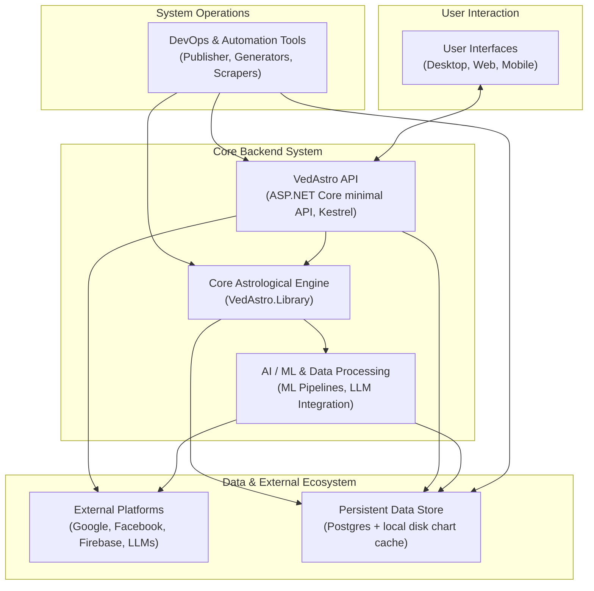

## Diagram 2 — Grouped by responsibility

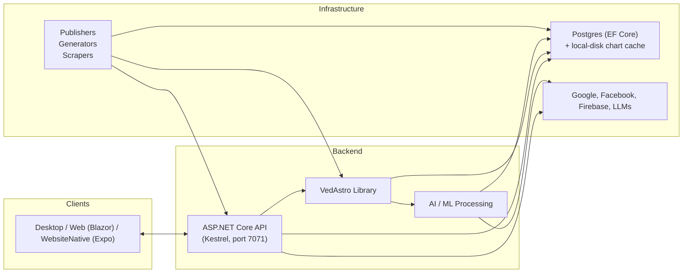

The VedAstro repository provides an engine that performs Vedic astrological calculations and
generates event predictions. It centralizes the data structures, algorithms, caching, and
external integrations necessary for these computations. This part of the system — the
`Library` project — was **not restructured** by the Postgres migration; only its data-access
internals (how it reads/writes persisted state) changed.

The engine defines foundational data structures that represent astrological concepts, such as
planetary positions and event definitions. It implements algorithms for calculating planetary
positions, Dasa periods, divisional charts, and electional astrology. The system also generates
various visual astrological charts and reports, including animated GIFs. Its management of
geographical locations and timezones supports accurate astrological computations, backed by
caching and Postgres-backed storage instead of Azure Table Storage. The engine also provides
mechanisms for defining and calculating astrological events, standardizing their logic through
delegation.

A centralized API manages astrological calculations, user data, authentication, and logging.
It is now an **ASP.NET Core minimal API running on Kestrel** (`API/Program.cs`), not Azure
Functions, and persists data to **Postgres via EF Core** (`Data/` project), not Azure Table
Storage. Chart images are cached to **local disk** (configurable directory), not Azure Blob
Storage. This API includes mechanisms for controlling request volume and ensuring fair usage.
See [API Services and Data Management](#api-services-and-data-management).

The project offers a Blazor WebAssembly desktop/web frontend (`Website/`, still the production
frontend during the Phase 3 transition) alongside a new React Native (Expo) frontend
(`WebsiteNative/`) that is the active development target and eventual replacement. See
[Frontends](#frontends-desktop-web-and-mobile).

Machine learning components generate data and classify astrological patterns for compatibility
predictions (`MatchMLPipeline/`, now Postgres-backed). The system integrates with the Hugging
Face Hub to manage extensive planetary data for question-answering tasks, and processes
unstructured PDF text for embeddings (`DocToEmbeddings/`) — neither of these were ever
Azure-coupled, so the migration didn't touch them.

Various utility and automation tools support development and operations — see
[Utility and Automation Tools](#utility-and-automation-tools) and
[Deployment and Publishing](#deployment-and-publishing) for their current (mixed) migration
status.

### Astrological Calculation and Prediction Engine

## Diagram 3

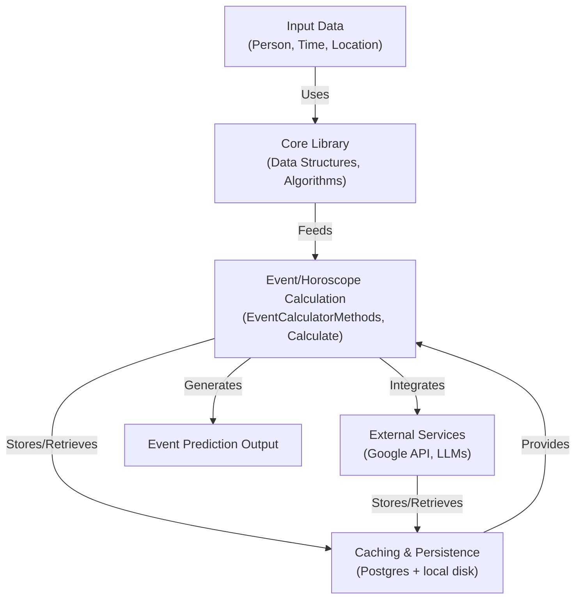

The VedAstro project's core is an astrological calculation and prediction engine, housed
primarily within the `Library` directory. Its fundamental purpose is to combine astrological
logic and data over time to generate event predictions.

At the heart of the system are core data structures that represent astrological concepts and
entities: `Constellation` for celestial positions, `Dasa` for planetary periods, and
`Bhinnashtakavarga` for benefic points in zodiac signs, among others. These structures are
designed for serialization to/from JSON via an `IToJson` interface (see the
[Constellation serialization fix](#known-migration-gaps-pending-phase-4) below for one bug found
in this area during this audit).

Persisted entities that used to live in `Library/Data/AzureTable/*.cs` (interfacing directly
with Azure Table Storage) have been replaced by plain POCO entities in **`Data/Entities/*.cs`**
(the new `VedAstro.Data` project), accessed through EF Core repositories in
`Data/Repositories/*.cs`, all wired into DI in `API/Program.cs`. See
[Data Persistence with Postgres](#data-persistence-with-postgres) for the full old→new entity
mapping.

Geographical location and timezone management is handled by `LocationManager` in
`Library/Logic/Calculate/LocationManager.cs`. This class is still live and still the
external-API/cache-provider abstraction it always was — only its internals changed: it used to
hold 9 raw Azure `TableClient` instances hit directly against
`https://{account}.table.core.windows.net/...`; it now delegates to 7 named Postgres repositories
(`AddressGeoLocation`, `CoordinatesGeoLocation`, `GeoLocationTimezone`,
`GeoLocationTimezoneMetadata`, `IpAddressGeoLocation`, `IpAddressGeoLocationMetadata`,
`SearchAddressGeoLocation`) declared in `Library/Logic/Repositories.cs`. A separate, unrelated
calculation-facing layer (`Calculate.AddressToGeoLocation`, `Calculate.GeoLocationToTimezone`,
etc. in `Library/Logic/Calculate/CoreMisc.cs`) sits above it and is what most calculators
actually call.

The engine also incorporates caching mechanisms. `CacheManager` (`Library/Logic/CacheManager.cs`)
manages in-memory caches that can persist to disk, unchanged by the migration. `AzureCache`
(`Library/Logic/AzureCache.cs`) — despite its name — is now a thin compatibility shim that
forwards every call to `Repositories.ChartCache`, an `IChartImageCache` backed by
`Data/Cache/LocalDiskChartImageCache.cs` (flat files on disk, configured via
`ChartCacheDirectory` in `API/appsettings.json`). The class name is stale and worth renaming in
a future cleanup — there is no Azure Blob Storage involved anywhere in this path anymore.

Event management, the core algorithms (`Core.cs`, `Ashtakavarga.cs`, `VimshottariDasa.cs`,
`Vargas.cs`, `Muhurtha.cs`, `Numerology.cs`), and the delegate-based event/horoscope
calculator pattern (`EventCalculatorDelegate`, `HoroscopeCalculatorDelegate`,
`EventGenerator`) are **unchanged** by the migration — see
[Astrological Data Structures](#astrological-data-structures),
[Core Astrological Algorithms](#core-astrological-algorithms), and
[Event Management and Delegation](#event-management-and-delegation) below, which still hold as
originally documented.

External integrations are managed through `CalendarManager` (Google Calendar), `ChatAPI`
(LLM-based predictions and text embeddings — see `API/appsettings.Development.json`'s
`LOCAL_LLM_*` env vars for the local LM Studio dev flow), and `LLMEmbeddingManager` — all
unchanged in shape, though `ChatAPI`'s persistence (chat history) now goes to Postgres
(`Data/Entities/ChatMessageEntity.cs`) instead of Azure Table Storage.

## Astrological Data Structures

## Diagram 4

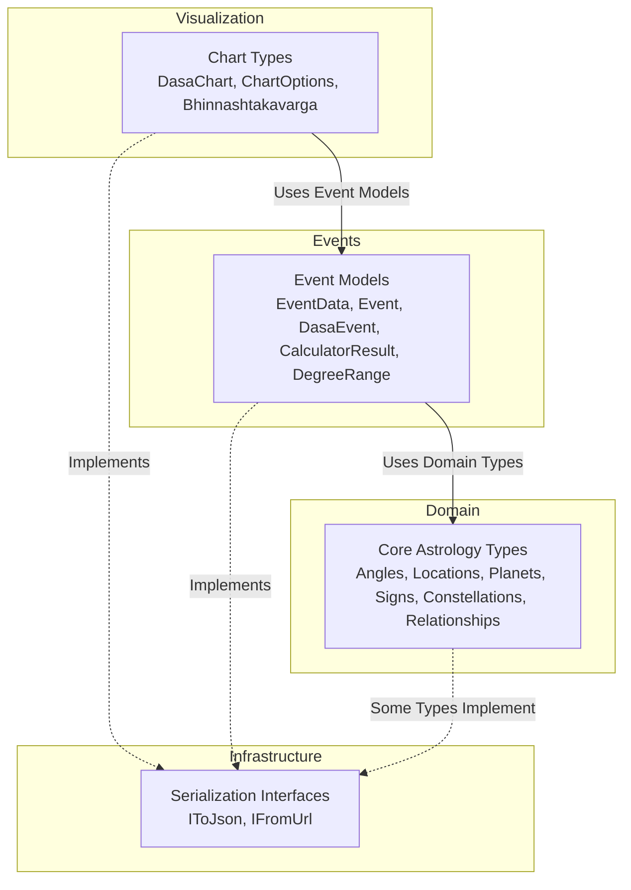

This section is unchanged by the migration — the astrological domain model lives entirely in
`Library/Data` and `Library/Data/Enum`, independent of how it's persisted.

Central to representing astrological information: `Bhinnashtakavarga` (7x12 benefic-point
table), `Constellation` (a specific point within a constellation — name, quarter, degree; **now
implements `IToJson`**, see the bug note below), `Dasa` (ruling planetary periods), and
`DegreeRange` (angular ranges).

Enumerations in `Library/Data/Enum` define a standardized vocabulary: `AnimalName`, `Avasta`,
`ConstellationName`, `ZodiacName`, `PlanetMotion`, `PlanetToPlanetRelationship`/
`PlanetToSignRelationship`, `Ayanamsa`/`SimpleAyanamsa`, `ChartType` (Rasi, Navamsha, etc.),
`EventName`/`HoroscopeName`, `EventTag`.

`Event` (`Library/Data/Event.cs`) is the fundamental temporal-event structure. `EventData`
extends it with an `EventCalculatorDelegate`. `DasaEvent` wraps `Event` with Dasa-specific
properties. `ChartOptions` and `DasaChart` manage chart-generation configuration and report
data respectively.

`Angle` (degrees/minutes/seconds arithmetic) and `GeoLocation` (coordinates + name) are
fundamental utility types. `CalculatorResult` encapsulates a calculation's pass/fail outcome.

Most of these implement `IToJson`/`IFromUrl` for JSON and URL-parameter interchange — this is
how the API's reflection-based dispatcher (`API/FrontDesk/OpenAPI.cs`) serializes calculator
return values. **One gap found in this area during this session's chart-rendering work:**
`Constellation` did *not* implement `IToJson` (only `ZodiacSign` did), so any endpoint
returning a `Constellation` (e.g. `PlanetConstellation`, `HouseConstellation`) serialized to an
empty `{}` object over the wire — fixed by adding a `ToJson()` matching the `{Name, Quarter,
DegreesIn}` shape `ZodiacSign` already used.

## Data Persistence with Postgres

Azure Table Storage has been fully replaced by **Postgres, accessed through Entity Framework
Core**, in a new `Data/` project (`VedAstro.Data.csproj`). The old `Library/Data/AzureTable.cs`
(the central Azure Table client-provider class) and `API/TableData/*.cs` (API-side Azure Table
entities) have been **deleted outright**, not left as dead code.

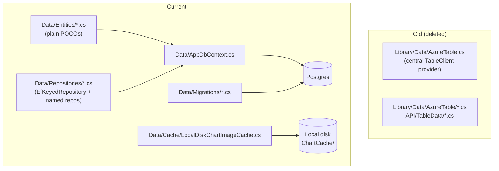

Old entity → new home mapping, confirmed against the current codebase:

| Old Azure Table entity | Current home |
|---|---|
| `BodyInfoDatasetEntity`, `PersonNameEmbeddingsEntity` | `Data/Entities/MatchMLDatasetEntities.cs` |
| `LifeEventRow` | `Data/Entities/LifeEventRow.cs` + `ILifeEventRepository` |
| `PersonListEntity` | `Data/Entities/PersonListEntity.cs` (extensions in `Library/Logic/PersonListEntityExtensions.cs`) + `IPersonRepository` |
| `PersonShareRow` | `Data/Entities/PersonShareRow.cs` + `IPersonShareRepository` |
| `UserDataListEntity` | `Data/Entities/UserDataListEntity.cs` + `IUserDataRepository` |
| `AnalyticsEntity` and other statistic rows | `Data/Entities/StatisticEntities.cs`, `CallInfoStatisticEntity.cs` |
| `CallStatusEntity` | `Data/Entities/CallStatusEntity.cs` + `ICallTrackerRepository` |
| `GeoLocationCacheEntity` + the 6 other geolocation entities (address/coordinates/IP/timezone + metadata variants) | `Data/Entities/GeoLocationEntities.cs` (7 tables) |
| `OpenAPIErrorBookEntity` | `Data/Entities/OpenAPIErrorBookEntity.cs` + `IOpenAPIErrorBookRepository` |
| `OpenAPILogBookEntity` | `Data/Entities/WebsiteLogEntities.cs` + `IWebsiteErrorLogRepository`/`IWebsiteDebugLogRepository` |
| `AnonymousIpCallRecords` / `SubscriberCallRecords` (throttling) | `IAnonymousIpCallRecordRepository` / `ISubscriberCallRecordRepository` |
| Azure Blob chart-image cache | `Data/Cache/LocalDiskChartImageCache.cs` (`IChartImageCache`) |
| *(new — no old equivalent)* | `Data/Entities/ChatMessageEntity.cs` (ChatAPI history), `SavedMatchReportEntity.cs` (saved match reports, a genuinely new feature) |

`Data/Migrations/` contains the EF Core migration history (`InitialCreate`,
`AddGeoLocationCacheTables`, `AddMatchMLDatasetTables`, `AddChatTables`,
`AddSavedMatchReportTable`), applied via `dotnet ef database update` per `CLAUDE.md`.

**One leftover found during this audit:** `Library/Data/AzureTable/MarriageTrainingDatasetEntity.cs`
is a genuine dead file — still physically present, still references the old Azure Table
pattern, and is not referenced anywhere else in the codebase. It should be deleted or migrated
alongside `BodyInfoDatasetEntity`'s equivalent.

## Core Astrological Algorithms

## Diagram 5

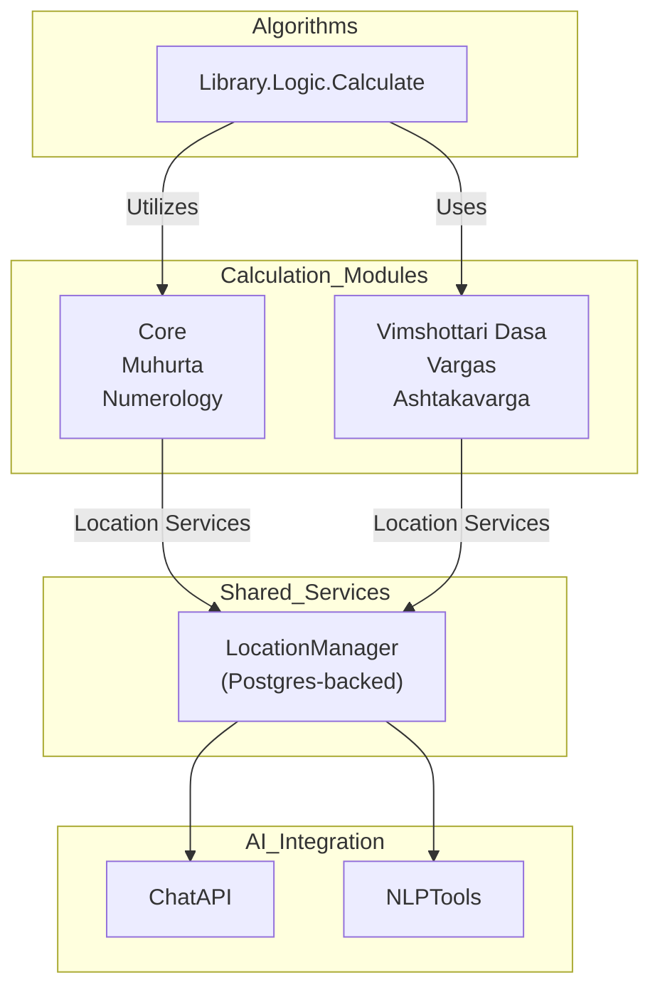

This section is unchanged by the migration. Planetary and house calculations
(`Library/Logic/Calculate/Core.cs`) cover houses owned by a planet, planets in houses, house
lords, planetary aspects/conjunctions/strength, sunrise/sunset, IshtaKaala, HoraAtBirth, etc.,
with results cached via `CacheManager.GetCache`.

`Ashtakavarga.cs` computes Prastaraka/Sarvashtakavarga/Bhinnashtakavarga charts.
`VimshottariDasa.cs` computes hierarchical Dasa/Bhukti periods (up to 8 levels).
`Vargas.cs` computes divisional charts (Hora D2, Navamsha D9, etc.) from precomputed tables.
`Muhurtha.cs` computes electional-astrology timings (Tarabala, Chandrabala, Panchaka, etc.),
using Pancha Pakshi data from `PanchaPakshi.cs`. `Numerology.cs` derives BirthNumber/
DestinyNumber/NameNumber via Chaldean numerology.

`ChatAPI.cs` integrates with LLMs for conversational predictions (now persisting chat history
to Postgres instead of Azure Table Storage — see [ChatMessageEntity](#data-persistence-with-postgres)).

## Astrological Chart and Report Generation

## Diagram 6

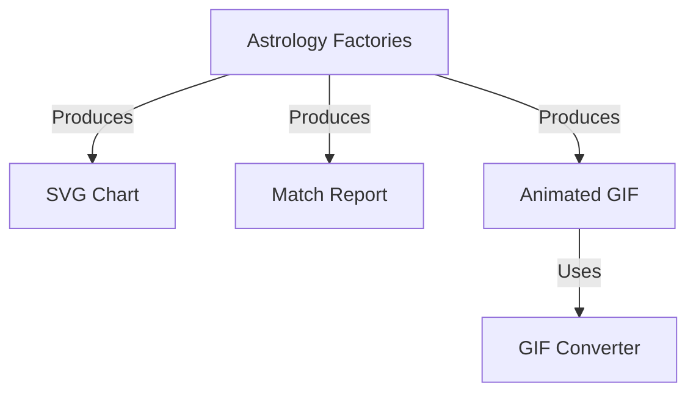

The project employs a factory pattern (`Library/Logic/Factory/*.cs`) to generate charts and
reports, primarily as SVG, with animated-GIF support for event timelines.

`EventsChartFactory.cs` creates SVG event-timeline charts. `MatchReportFactory.cs` computes
Vedic compatibility (Kuta) reports between two people. `SkyChartFactory.cs` produces sky charts
(zodiac ruler, houses, planet positions along the ecliptic) and can render an animated GIF by
sequencing SVG frames. `IndianChartFactory.cs` (formerly split across `NorthChartFactory.cs`/
`SouthChartFactory.cs`) renders South/North Indian style Kundali charts.

**Important caveat specific to this session's work:** `IndianChartFactory.cs`'s doc comment
notes it was *"reconstructed from scratch"* — the original chart-drawing implementation was
never actually committed to git in this repo; only its auto-generated API documentation
metadata survived (`Library/Data/OpenAPIStaticTable.cs`). This is unrelated to the Postgres
migration itself, but is worth flagging as a gap in the codebase's history: the "before" state
this doc's Azure-version sibling describes for `NorthChartFactory`/`SouthChartFactory` is only
approximately reconstructed, not restored verbatim. During this session, three concrete bugs
in this reconstructed code were found and fixed (see
[Known Migration Gaps](#known-migration-gaps-pending-phase-4) for the full list):
a required-but-unsent `ChartType` URL parameter that broke every Birth Chart request; a
`SkyChartFactory` per-house-icon template that embedded two complete SVG font definitions
**twelve times** (once per house marker), inflating a single chart response to ~4.6MB; and a
`GetAllPlanetLineIcons` row-stacking bug (`incrementRate` hardcoded to `0`) that caused
same-row planet icons to render on top of each other.

GIF encoding/decoding (`Library/Logic/GIFConverter/*.cs` — `AnimatedGifEncoder`, `NeuQuant`,
`LZWEncoder`, `GifDecoder`) is unchanged.

## Geographical Location and Timezone Management

## Diagram 7

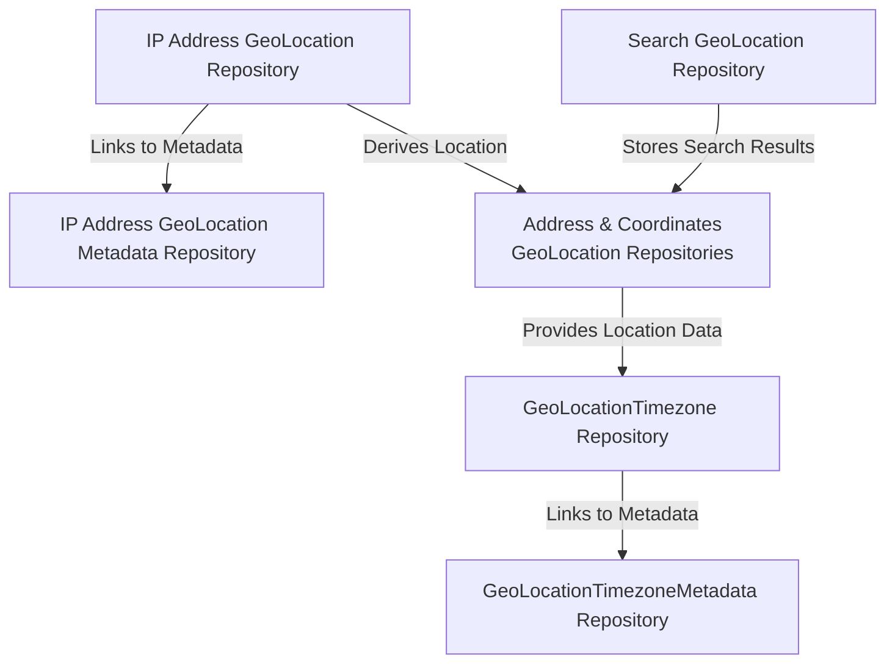

The system manages geographical locations and timezones through **Postgres tables** (via the 7
repositories listed in [Data Persistence with Postgres](#data-persistence-with-postgres)),
replacing the old Azure Table Storage entities 1:1 in shape (same `PartitionKey`/`RowKey`-style
lookup semantics, preserved via the `IPartitionRowKeyEntity` interface in
`Data/Entities/IPartitionRowKeyEntity.cs` so the access pattern didn't need to change, only the
backing store).

Address-based, coordinate-based, IP-based, and search-result geolocation lookups are all
cached this way to minimize redundant external geocoding API calls. Timezone data (standard
offset, DST rules) is similarly cached, keyed by coordinates. This is functionally identical to
the pre-migration design described in the Azure-version doc — only the storage engine changed.

## Event Management and Delegation

Unchanged by the migration. `AlgorithmFuncs`, `EventCalculatorDelegate`,
`HoroscopeCalculatorDelegate` (`Library/Data/Delegate/CalculatorDelegates.cs`), and
`EventGenerator` (`Library/Data/Delegate/EventGenerator.cs`) standardize calculation/generation
method signatures across the engine, enabling `AutoCalculator`
(`Library/Logic/AutoCalculator.cs`) to discover and invoke them via reflection.

## API Services and Data Management

## Diagram 8

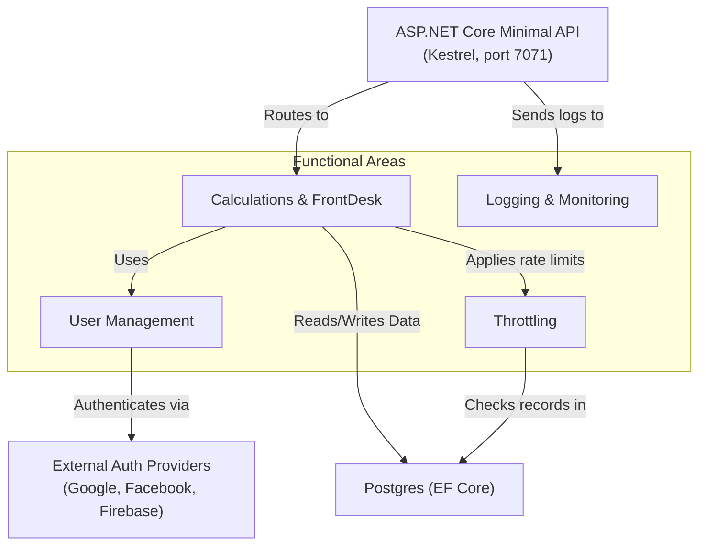

The API (`API/` directory) is now an **ASP.NET Core minimal API** (`API/API.csproj`, SDK
`Microsoft.NET.Sdk.Web`), running on Kestrel and bound to `http://localhost:7071` in
development (`API/Program.cs`). There is no Azure Functions SDK, no `[Function]`/`[FunctionName]`
attributes, and no `host.json`/`function.json` anywhere in this project.

Data persistence is via **Postgres through EF Core** (`AppDbContext`, registered with
`AddDbContextFactory<AppDbContext>(...UseNpgsql(...))` in `API/Program.cs`), covering
analytics, call-status tracking, geolocation caching, error logging, and general API logs — see
[Data Persistence with Postgres](#data-persistence-with-postgres) for the entity mapping.

### API Endpoint Design and Implementation

The reflection-based dynamic dispatcher (`API/FrontDesk/OpenAPI.cs`) is unchanged in design: a
generic `Calculate/{calculatorName}/{*fullParamString}` route reflects onto matching methods in
`Calculate`/`PersonAPI`, parsing compulsory then optional URL parameters. `PersonAPI.cs`
(add/update/delete/get person records, visitor→user data migration on login),
`WebsiteLoggerAPI.cs` (client-side error/debug logging), `BirthTimeFinderAPI.cs`,
`EventsChartAPI.cs`, and `MatchAPI.cs` all still exist with the same responsibilities as
before — only their data access underneath was repointed at Postgres repositories.

### API Authentication and User Management

Authentication now supports **three** methods, not two:

- `GET /api/SignInGoogle/Token/{token}` — `GoogleJsonWebSignature.ValidateAsync` (unchanged).
- `GET /api/SignInFacebook/Token/{token}` — Facebook Graph API token validation (unchanged).
- `GET /api/SignInFirebase/Token/{token}` — **new**, `FirebaseAuth.DefaultInstance.VerifyIdTokenAsync`
  (`FirebaseAdmin` NuGet package). This verifies tokens produced by `WebsiteNative`'s sign-in
  flow, which drives Google/Facebook OAuth via `expo-auth-session` and then exchanges the
  resulting token for a Firebase credential client-side, rather than sending the raw
  Google/Facebook token straight to the API the way the Blazor site does.

All three funnel into the same `AddOrUpdateUserData` helper and the same Postgres `UserData`
table (`Data/Entities/UserDataListEntity.cs`) — one shared user identity regardless of which
frontend or provider a user signs in through.

### API Throttling and Rate Limiting

Unchanged in design (`API/ThrottleManager.cs`): browser and valid-API-key requests proceed at
full speed; anonymous IP requests are rate-limited against a configurable per-60-second
threshold. Call records (`AnonymousIpCallRecordEntity`, `SubscriberCallRecordEntity`) are now
Postgres rows via `IAnonymousIpCallRecordRepository`/`ISubscriberCallRecordRepository`, replacing
the old `AzureTable.AnonymousIpCallRecords`/`SubscriberCallRecords` tables.

### API Logging and Error Reporting

Unchanged in design. `APILogger` (`API/ApiLogger.cs`) logs exceptions (caller IP, URL, branch,
exception JSON) — now to `Data/Entities/OpenAPIErrorBookEntity.cs` via
`IOpenAPIErrorBookRepository`, instead of Azure Table Storage. `WebsiteLoggerAPI.cs`'s
client-error/debug endpoints now persist to `Data/Entities/WebsiteLogEntities.cs`
(`IWebsiteErrorLogRepository`/`IWebsiteDebugLogRepository`).

## Frontends: Desktop, Web, and Mobile

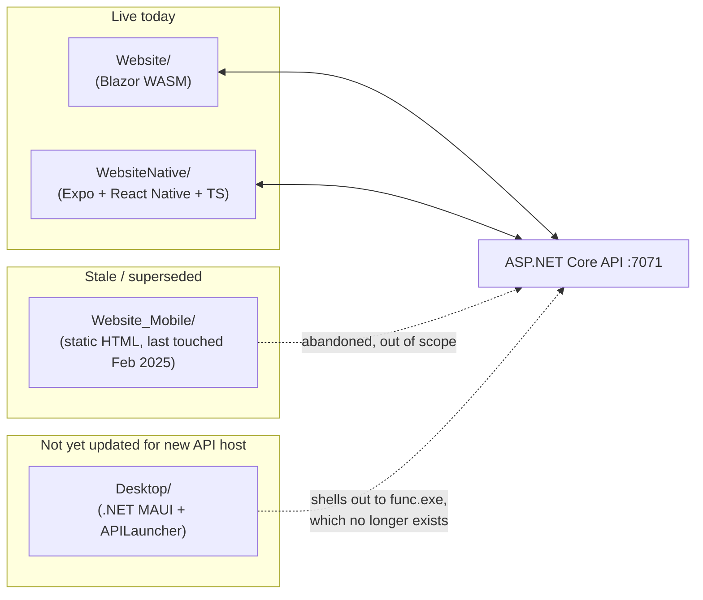

**`Website/`** — the Blazor WebAssembly frontend, still the current production frontend during
the Phase 3 transition. Unchanged: still directly integrates the Facebook JS SDK and Google API
JS for sign-in (`Website/wwwroot/index.html`).

**`WebsiteNative/`** — a **new** React Native (Expo SDK ~57) + TypeScript app, not present at all
in the pre-migration architecture. Uses `expo-router` file-based routing, React 19/RN 0.86,
Zustand for state, and the Firebase SDK for auth. Its routes under `src/app/` mirror `Website/`'s
calculator and account pages 1:1 (Horoscope, Match, BirthTimeFinder, GoodTimeFinder, Numerology,
Account/Person management, Journal, Blog, legal pages, etc.), talking to the same ASP.NET Core
API. `migration.md` explicitly designates this as the intended replacement for both `Website/`
and `Website_Mobile/`, run side-by-side with the old frontend during the transition rather than
cut over all at once. Chart/table components render server-produced SVGs via
`react-native-svg`'s `SvgUri` (not React Native's built-in `Image`, which only decodes SVG on
web — see the [Known Migration Gaps](#known-migration-gaps-pending-phase-4) note on this bug,
found and fixed during this session).

**`Website_Mobile/`** — the old mobile-optimized static-HTML/JS frontend. Explicitly marked
*"untouched, out of scope"* in `migration.md`; last git commit February 2025, over a year stale
relative to `WebsiteNative`'s active daily development. Superseded, not maintained, not deleted
yet.

**`Desktop/`** — the .NET MAUI cross-platform desktop app. **Not migrated, and currently
broken relative to the new API.** `Desktop/APILauncher/Program.cs`,
`Desktop/Windows/Form1.cs`, and the macOS launcher all still shell out to
`Azure.Functions.Cli/func.exe start` to launch the backend — but the migrated API no longer
builds as an Azure Functions host, so this invocation will fail once a build stops producing
Functions-shaped output. `migration.md`'s phased plan doesn't mention `Desktop/` at all; per its
Phase 4 notes, remaining Azure Functions scaffolding is meant to be removed at cutover, so this
is expected-but-not-yet-addressed technical debt rather than a surprise regression.

## Machine Learning and Data Pipelines

The project incorporates ML/data components for astrological matching, planetary-data
distribution, and unstructured-text processing.

**`MatchMLPipeline/`** — generates and classifies compatibility-prediction datasets. Contrary
to an initial assumption that this directory would be untouched by the migration, it was
**actively repointed at Postgres**: `DatasetFactory.cs`'s own comment reads *"Postgres wiring
(replaces the old raw Azure Table Storage TableClient fields)"*, and it now builds an
`IDbContextFactory<AppDbContext>` directly (no DI host, since this is a standalone console
tool) against `Data/VedAstro.Data.csproj`. `PersonListEntity` remains the domain type name, but
it's now backed by `PersonRepository`, not Azure Table Storage. The `NearestCentroidClassifier`
and ILGPU-based GPU acceleration are unchanged. **One Azure dependency remains**: LLM extraction
calls still hit an Azure-hosted inference endpoint
(`https://Meta-Llama-3-70B-Instruct-*.inference.ai.azure.com`) — this is an external inference
API, not the storage layer the migration targeted, so it was left as-is.

**`HuggingFace/`** (planetary-data pull/push to the Hugging Face Hub) and **`DocToEmbeddings/`**
(PDF text extraction and hierarchical chunking) — both untouched, and never had an Azure
dependency to migrate away from.

## Utility and Automation Tools

Migration status varies per tool — some were actively updated, some were never Azure-coupled,
and two (`Publisher/`, and the API's own `Dockerfile`) are genuine leftovers pending Phase 4:

| Tool | Purpose | Migration status |
|---|---|---|
| `Console/` | Finds optimal birth times, generates event-chart SVGs | Mostly updated — Azure Blob calls are now dead/commented (`Console/Program.cs`), though `Console.csproj` still carries an unused `Azure.Storage.Blobs` package reference (cleanup opportunity) |
| `LLMCoder/` | WinForms LLM coding assistant | Untouched, unrelated to the migration (its few "Azure" hits are `Color.Azure`, a WinForms color constant, not cloud services) |
| `MigrateGeoLocationData/` | Bulk-loads geo/timezone CSV data | **Actively migrated** — `Program.cs` now uses EF Core + `Npgsql` against the same `AppDbContext`/`PersonRepository` as the API. The old Azure-Table-targeting code (`ProgramTimezone.cs`) is fully commented out, superseded rather than deleted outright |
| `WebScraper/` | Python scraper for public astrological data (Astro-Seek.com) | Unaffected — already POSTs to `http://localhost:7071/api/Calculate/AddPerson/...`, which is still the correct port/shape under the new Kestrel host |
| `StaticTableGenerator/` | Generates OpenAPI metadata, Python stubs, static data tables via Roslyn | Untouched, never had an Azure dependency |

## Deployment and Publishing

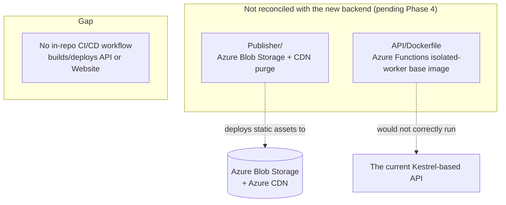

**This section documents a real, unreconciled gap, not a described-and-working system.**

`Publisher/` still deploys web assets entirely through **Azure Blob Storage + Azure CDN**:
`Program.cs` uses `Azure.Storage.Blobs`'s `BlobServiceClient`, syncs local folders to a blob
container, injects a SHA256 hash of `js/VedAstro.js` into `js/app.js` for cache-busting, and
purges the Azure CDN via `az cdn endpoint purge` shell calls. None of this was touched by the
Postgres migration. `migration.md`'s own "Decisions" section records the new hosting target as
**"self-hosted on local computer"** — so `Publisher/`'s Blob+CDN static-asset pipeline is not
just old, it actively describes a different hosting model than what the rest of this document
describes, and it isn't clear from the repo alone how (or whether) it's still used for
whatever currently serves the deployed API at `vedastroapi.azurewebsites.net` (per `CLAUDE.md`).

`API/Dockerfile` is similarly stale: its base image is
`mcr.microsoft.com/azure-functions/dotnet-isolated:4-dotnet-isolated7.0`, it sets
`AzureWebJobsScriptRoot`/`AzureFunctionsJobHost__*` environment variables, and it targets the
.NET 7 isolated-worker SDK — none of which apply to the current API, which is a plain ASP.NET
Core Kestrel app targeting .NET 8 (`API/API.csproj`). This Dockerfile would not correctly build
or run the current API as written.

There is no other CI/CD configuration in this repository: the only GitHub Actions workflow
(`.github/workflows/UpdateLLMCodes.yml`) just mirrors the unrelated `LLMCoder/` folder to a
separate repo. Whatever currently deploys the API and Website to production is either a manual
process or lives outside this repository — this document can't confirm which.

## Known Migration Gaps (pending Phase 4)

A consolidated list of every stale-or-broken item found while producing this document, cross
referenced against `migration.md`'s own Phase 4 plan ("point hosting at the new stack, remove
Blazor project, remove remaining Azure SDK references and Azure Functions scaffolding"). None
of these are surprises exactly — they're the specific things Phase 4 is scoped to clean up —
but they weren't itemized anywhere before this audit:

1. **`API/Dockerfile`** still uses an Azure Functions isolated-worker base image and .NET 7 SDK;
   won't correctly containerize the current .NET 8 Kestrel API.
2. **`Desktop/`** (APILauncher + Windows/macOS launchers) still shells out to
   `Azure.Functions.Cli/func.exe start`; will fail once builds stop producing Functions-shaped
   output.
3. **`Publisher/`** still deploys exclusively via Azure Blob Storage + Azure CDN, describing a
   hosting model (`migration.md` records the new target as "self-hosted on local computer")
   that no longer matches the rest of the architecture.
4. **No CI/CD workflow in-repo** builds or deploys the API or Website for the new architecture.
5. **`Library/Data/AzureTable/MarriageTrainingDatasetEntity.cs`** is dead, unreferenced code —
   the one Azure Table entity file left physically in the repo after the rest were deleted.
6. **`AzureCache.cs`**'s class name is misleading — it's fully local-disk backed now, not Azure
   Blob backed. Cosmetic, but worth renaming to avoid confusing future readers.
7. **`Console.csproj`** carries an unused `Azure.Storage.Blobs` package reference (the code that
   used it is now commented out).
8. **`Website_Mobile/`** is stale and unmaintained (last commit Feb 2025) but not yet deleted,
   despite being explicitly superseded by `WebsiteNative/`.
9. **`Constellation` didn't implement `IToJson`** (found/fixed this session) — any endpoint
   returning a bare `Constellation` serialized to `{}` over the wire.
10. **`IndianChartFactory.cs`'s `SouthIndianChart`/`NorthIndianChart`** required a `ChartType`
    URL parameter that no client ever sent, breaking every Birth Chart request outright (found/
    fixed this session — `chartType` now defaults to `ChartType.RasiD1`).
11. **`SkyChartFactory.cs`'s per-house-icon template** embedded two complete SVG font
    definitions once per house marker (12x duplication), inflating a single Sky Chart response
    to ~4.6MB (found/fixed this session — fonts removed, relies on the client's default
    sans-serif instead).
12. **`SkyChartFactory.cs`'s `GetAllPlanetLineIcons`** had its row-collision-avoidance
    `incrementRate` hardcoded to `0`, silently defeating the vertical-stacking logic and causing
    same-row planet icons to render on top of each other (found/fixed this session).
13. **`WebsiteNative`'s chart components** (`IndianChart.tsx`, `SkyChartViewer.tsx`) used React
    Native's built-in `Image` component for server-rendered SVGs, which only decodes SVG on web
    (via the browser) — not on native iOS/Android, where charts would render blank. Fixed this
    session by switching to `react-native-svg`'s `SvgUri`.
