This document reflects the **current, non-Azure architecture** as of the Postgres migration
(branch `feature/postgres-migration`). For the pre-migration Azure Functions + Azure Table/Blob
Storage architecture, see [vedAstroArchitecture_AzureVersion.md](vedAstroArchitecture_AzureVersion.md)
(frozen snapshot, kept for comparison only).

The migration is tracked live in `migration.md` (repo root). Summary of where things stand:

- **Phase 1+2 (API + data layer: Azure Functions → ASP.NET Core, Azure Table/Blob → Postgres +
  local disk)** — done and verified.
- **Phase 3 (frontend: Blazor WASM → React Native/Expo + TypeScript, `WebsiteNative/`)** — in
  progress; old (`Website/`) and new (`WebsiteNative/`) frontends run side by side.
- **Phase 4 (cutover + cleanup — point production hosting at the new stack, delete the Blazor
  project, remove remaining Azure SDK references/scaffolding)** — **not started as a phase**,
  but several of its safe code-level items (a stale `API/Dockerfile`, a broken `Desktop/`
  launcher, dead Azure Table leftovers) have since been fixed piecemeal. The actual DNS/hosting
  cutover remains untouched — see [Known Migration Gaps](#known-migration-gaps-pending-phase-4)
  at the end of this document for the full list of what's fixed vs. still open.

## Solution Projects at a Glance

Every project registered in `VedAstro.sln`, and whether it's actually needed by the current
non-Azure architecture:

| Project                 | Needed?          | What it does                                                                                   |
|-------------------------|------------------|------------------------------------------------------------------------------------------------|
| `Library`               | **Yes — core**   | The astrology calculation engine (charts, dasas, algorithms). Everything else depends on it.   |
| `API`                   | **Yes — core**   | The live ASP.NET Core minimal API (Kestrel), backed by Postgres. This is the backend.          |
| `VedAstro.Data`         | **Yes — core**   | The EF Core/Postgres data layer (entities, repositories, migrations, local-disk chart cache) that replaced Azure Table Storage. |
| `Website`               | **Yes — current**| The Blazor WebAssembly frontend — still the live production frontend during the Phase 3 transition to `WebsiteNative`. |
| `LibraryTests`          | Yes — dev/CI     | Unit tests for `Library`. Not shipped, but needed to trust changes to the calculation engine. |
| `VedAstro.Data.Tests`   | Yes — dev/CI     | Tests for the Postgres data layer (spins up a real ephemeral Postgres via Testcontainers).|
| `API.IntegrationTests`  | Yes — dev/CI     | Full HTTP-level tests against the real API via `WebApplicationFactory`.                   |
| `StaticTableGenerator`  | Useful — dev tool| Codegen: regenerates `OpenAPIStaticTable.cs`, Python API stubs, and static event/horoscope data classes from XML + Roslyn. Run occasionally when calculator methods or XML data change, not part of runtime.|
| `Console`               | Useful — dev tool        | Standalone CLI for finding optimal birth times / generating event-chart SVGs. Uses `Library` directly, no Azure dependency. |
| `MigrateGeoLocationData`| Useful — occasional tool | Bulk-loads geo/timezone CSV data into Postgres. Actively migrated (uses `AppDbContext`/`PersonRepository`), not Azure-based.|
| `WebScraper`            | Useful — occasional tool | Python scraper pulling public astrological data, POSTs to the local API (`http://localhost:7071`). |
| `LLMCoder`              | Unrelated but harmless   | A WinForms dev-productivity tool for chatting with LLMs while coding. Nothing to do with VedAstro's runtime architecture either way. |
| `Website_Mobile`        | **No — deprecated**      | Old static-HTML mobile frontend. Explicitly marked out-of-scope in `migration.md`, last touched Feb 2025, superseded by `WebsiteNative`. Not deleted yet.|
| `APITester`             | **No — stale**           | Manual console smoke-test tool. Hardcoded to `https://vedastroapi.azurewebsites.net/api/` (the old Azure Functions endpoint) — never updated for the new API, not referenced by anything else, targets the out-of-support `net7.0`. Builds, but points at the wrong/old target. |
| `Demo` (`Website/wwwroot/Demo/`) | **No — dead**   | An old-style ASP.NET "Web Site" project (classic .NET Framework 4.8, `AspNetCompiler`-based) nested inside `Website/wwwroot/Demo/`. Contains JS/Python samples that also hit the old Azure Functions domain; its own README is empty; the repo-root README's link to it already points at a stale path. **Cannot build at all in this repo's toolchain** — ASP.NET "Web Site" projects require the classic Windows-only ASP.NET Compiler bundled with full MSBuild, not `dotnet build`, so the `MSB4249` failure is a hard incompatibility, not a config issue. Nothing else references or serves it. |
| `MaintenanceAPI`       | **No — phantom** | The `.sln` references `MaintenanceAPI/MaintenanceAPI.csproj`, but that folder doesn't exist anywhere in the repo, on any branch (`git log --all` shows it was never committed). Dead solution-file entry.  |

Note: `Desktop/*` (APILauncher, Windows, MAUI app), `MatchMLPipeline/`, `DocToEmbeddings/`, and
`ViewComponents/` are real, actively-relevant projects (see their own sections below) but are
**not** part of `VedAstro.sln` at all — they build independently.

# vedastro/vedastro Architecture

## Diagram 1 — System overview

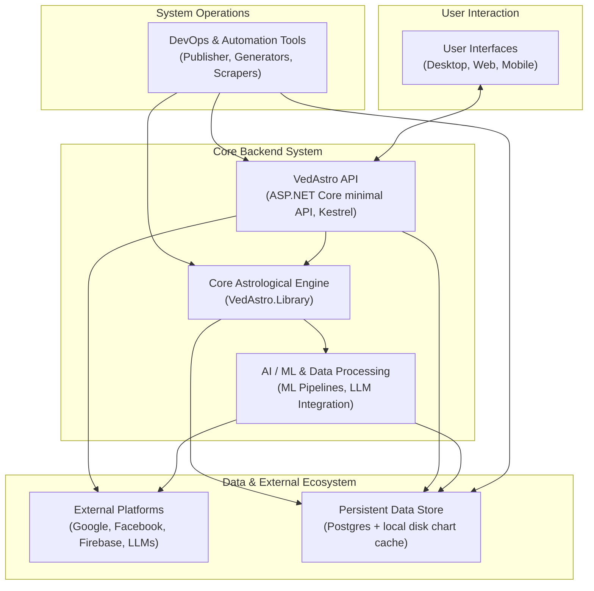

## Diagram 2 — Grouped by responsibility

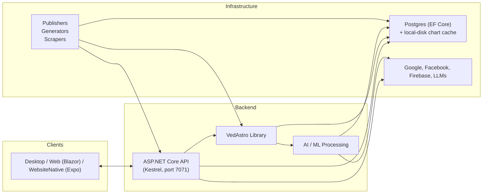

The VedAstro repository provides an engine that performs Vedic astrological calculations and
generates event predictions. It centralizes the data structures, algorithms, caching, and
external integrations necessary for these computations. This part of the system — the
`Library` project — was **not restructured** by the Postgres migration; only its data-access
internals (how it reads/writes persisted state) changed.

The engine defines foundational data structures that represent astrological concepts, such as
planetary positions and event definitions. It implements algorithms for calculating planetary
positions, Dasa periods, divisional charts, and electional astrology. The system also generates
various visual astrological charts and reports, including animated GIFs. Its management of
geographical locations and timezones supports accurate astrological computations, backed by
caching and Postgres-backed storage instead of Azure Table Storage. The engine also provides
mechanisms for defining and calculating astrological events, standardizing their logic through
delegation.

A centralized API manages astrological calculations, user data, authentication, and logging.
It is now an **ASP.NET Core minimal API running on Kestrel** (`API/Program.cs`), not Azure
Functions, and persists data to **Postgres via EF Core** (`Data/` project), not Azure Table
Storage. Chart images are cached to **local disk** (configurable directory), not Azure Blob
Storage. This API includes mechanisms for controlling request volume and ensuring fair usage.
See [API Services and Data Management](#api-services-and-data-management).

The project offers a Blazor WebAssembly desktop/web frontend (`Website/`, still the production
frontend during the Phase 3 transition) alongside a new React Native (Expo) frontend
(`WebsiteNative/`) that is the active development target and eventual replacement. See
[Frontends](#frontends-desktop-web-and-mobile).

Machine learning components generate data and classify astrological patterns for compatibility
predictions (`MatchMLPipeline/`, now Postgres-backed). The system integrates with the Hugging
Face Hub to manage extensive planetary data for question-answering tasks, and processes
unstructured PDF text for embeddings (`DocToEmbeddings/`) — neither of these were ever
Azure-coupled, so the migration didn't touch them.

Various utility and automation tools support development and operations — see
[Utility and Automation Tools](#utility-and-automation-tools) and
[Deployment and Publishing](#deployment-and-publishing) for their current (mixed) migration
status.

### Astrological Calculation and Prediction Engine

## Diagram 3

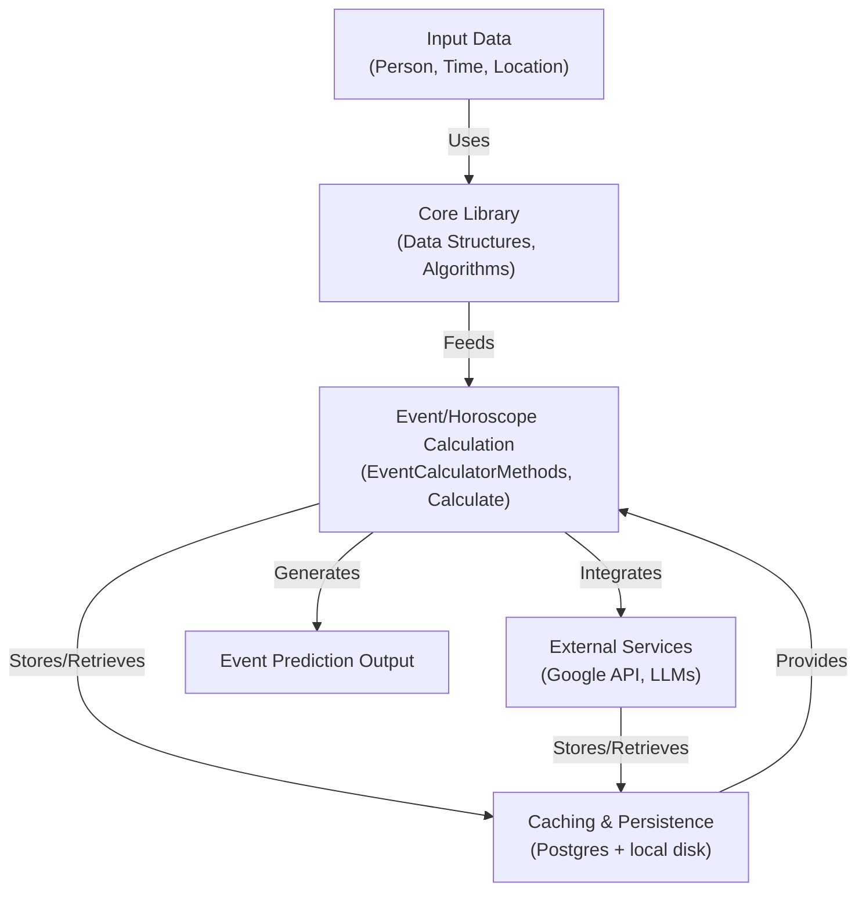

The VedAstro project's core is an astrological calculation and prediction engine, housed
primarily within the `Library` directory. Its fundamental purpose is to combine astrological
logic and data over time to generate event predictions.

At the heart of the system are core data structures that represent astrological concepts and
entities: `Constellation` for celestial positions, `Dasa` for planetary periods, and
`Bhinnashtakavarga` for benefic points in zodiac signs, among others. These structures are
designed for serialization to/from JSON via an `IToJson` interface (see the
[Constellation serialization fix](#known-migration-gaps-pending-phase-4) below for one bug found
in this area during this audit).

Persisted entities that used to live in `Library/Data/AzureTable/*.cs` (interfacing directly
with Azure Table Storage) have been replaced by plain POCO entities in **`Data/Entities/*.cs`**
(the new `VedAstro.Data` project), accessed through EF Core repositories in
`Data/Repositories/*.cs`, all wired into DI in `API/Program.cs`. See
[Data Persistence with Postgres](#data-persistence-with-postgres) for the full old→new entity
mapping.

Geographical location and timezone management is handled by `LocationManager` in
`Library/Logic/Calculate/LocationManager.cs`. This class is still live and still the
external-API/cache-provider abstraction it always was — only its internals changed: it used to
hold 9 raw Azure `TableClient` instances hit directly against
`https://{account}.table.core.windows.net/...`; it now delegates to 7 named Postgres repositories
(`AddressGeoLocation`, `CoordinatesGeoLocation`, `GeoLocationTimezone`,
`GeoLocationTimezoneMetadata`, `IpAddressGeoLocation`, `IpAddressGeoLocationMetadata`,
`SearchAddressGeoLocation`) declared in `Library/Logic/Repositories.cs`. A separate, unrelated
calculation-facing layer (`Calculate.AddressToGeoLocation`, `Calculate.GeoLocationToTimezone`,
etc. in `Library/Logic/Calculate/CoreMisc.cs`) sits above it and is what most calculators
actually call.

The engine also incorporates caching mechanisms. `CacheManager` (`Library/Logic/CacheManager.cs`)
manages in-memory caches that can persist to disk, unchanged by the migration. `AzureCache`
(`Library/Logic/AzureCache.cs`) — despite its name — is now a thin compatibility shim that
forwards every call to `Repositories.ChartCache`, an `IChartImageCache` backed by
`Data/Cache/LocalDiskChartImageCache.cs` (flat files on disk, configured via
`ChartCacheDirectory` in `API/appsettings.json`). The class name is stale and worth renaming in
a future cleanup — there is no Azure Blob Storage involved anywhere in this path anymore.

Event management, the core algorithms (`Core.cs`, `Ashtakavarga.cs`, `VimshottariDasa.cs`,
`Vargas.cs`, `Muhurtha.cs`, `Numerology.cs`), and the delegate-based event/horoscope
calculator pattern (`EventCalculatorDelegate`, `HoroscopeCalculatorDelegate`,
`EventGenerator`) are **unchanged** by the migration — see
[Astrological Data Structures](#astrological-data-structures),
[Core Astrological Algorithms](#core-astrological-algorithms), and
[Event Management and Delegation](#event-management-and-delegation) below, which still hold as
originally documented.

External integrations are managed through `CalendarManager` (Google Calendar), `ChatAPI`
(LLM-based predictions and text embeddings — see `API/appsettings.Development.json`'s
`LOCAL_LLM_*` env vars for the local LM Studio dev flow), and `LLMEmbeddingManager` — all
unchanged in shape, though `ChatAPI`'s persistence (chat history) now goes to Postgres
(`Data/Entities/ChatMessageEntity.cs`) instead of Azure Table Storage.

## Astrological Data Structures

## Diagram 4

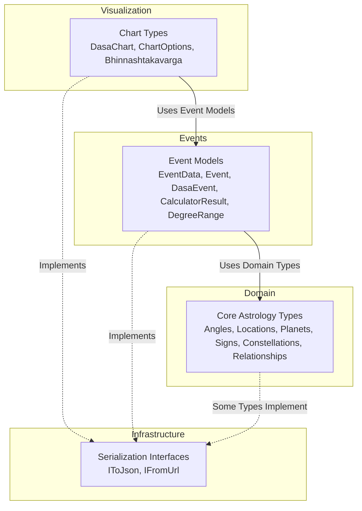

This section is unchanged by the migration — the astrological domain model lives entirely in
`Library/Data` and `Library/Data/Enum`, independent of how it's persisted.

Central to representing astrological information: `Bhinnashtakavarga` (7x12 benefic-point
table), `Constellation` (a specific point within a constellation — name, quarter, degree; **now
implements `IToJson`**, see the bug note below), `Dasa` (ruling planetary periods), and
`DegreeRange` (angular ranges).

Enumerations in `Library/Data/Enum` define a standardized vocabulary: `AnimalName`, `Avasta`,
`ConstellationName`, `ZodiacName`, `PlanetMotion`, `PlanetToPlanetRelationship`/
`PlanetToSignRelationship`, `Ayanamsa`/`SimpleAyanamsa`, `ChartType` (Rasi, Navamsha, etc.),
`EventName`/`HoroscopeName`, `EventTag`.

`Event` (`Library/Data/Event.cs`) is the fundamental temporal-event structure. `EventData`
extends it with an `EventCalculatorDelegate`. `DasaEvent` wraps `Event` with Dasa-specific
properties. `ChartOptions` and `DasaChart` manage chart-generation configuration and report
data respectively.

`Angle` (degrees/minutes/seconds arithmetic) and `GeoLocation` (coordinates + name) are
fundamental utility types. `CalculatorResult` encapsulates a calculation's pass/fail outcome.

Most of these implement `IToJson`/`IFromUrl` for JSON and URL-parameter interchange — this is
how the API's reflection-based dispatcher (`API/FrontDesk/OpenAPI.cs`) serializes calculator
return values. **One gap found in this area during this session's chart-rendering work:**
`Constellation` did *not* implement `IToJson` (only `ZodiacSign` did), so any endpoint
returning a `Constellation` (e.g. `PlanetConstellation`, `HouseConstellation`) serialized to an
empty `{}` object over the wire — fixed by adding a `ToJson()` matching the `{Name, Quarter,
DegreesIn}` shape `ZodiacSign` already used.

## Data Persistence with Postgres

Azure Table Storage has been fully replaced by **Postgres, accessed through Entity Framework
Core**, in a new `Data/` project (`VedAstro.Data.csproj`). The old `Library/Data/AzureTable.cs`
(the central Azure Table client-provider class) and `API/TableData/*.cs` (API-side Azure Table
entities) have been **deleted outright**, not left as dead code.

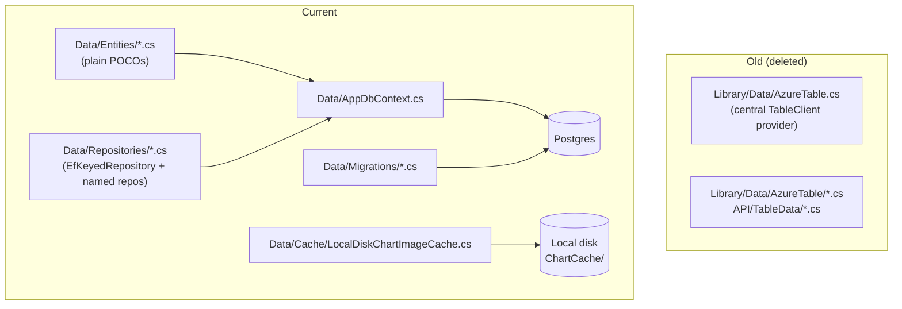

Old entity → new home mapping, confirmed against the current codebase:

| Old Azure Table entity                                                                                            | Current home                                                                                                                       |
|-------------------------------------------------------------------------------------------------------------------|------------------------------------------------------------------------------------------------------------------------------------|
| `BodyInfoDatasetEntity`, `PersonNameEmbeddingsEntity`, `MarriageTrainingDatasetEntity`                            | `Data/Entities/MatchMLDatasetEntities.cs`                                                                                          |
| `LifeEventRow`                                                                                                    | `Data/Entities/LifeEventRow.cs` + `ILifeEventRepository`                                                                           |
| `PersonListEntity`                                                                                                | `Data/Entities/PersonListEntity.cs` (extensions in `Library/Logic/PersonListEntityExtensions.cs`) + `IPersonRepository`            |
| `PersonShareRow`                                                                                                  | `Data/Entities/PersonShareRow.cs` + `IPersonShareRepository`                                                                       |
| `UserDataListEntity`                                                                                              | `Data/Entities/UserDataListEntity.cs` + `IUserDataRepository`                                                                      |
| `AnalyticsEntity` and other statistic rows                                                                        | `Data/Entities/StatisticEntities.cs`, `CallInfoStatisticEntity.cs`                                                                 |
| `CallStatusEntity`                                                                                                | `Data/Entities/CallStatusEntity.cs` + `ICallTrackerRepository`                                                                     |
| `GeoLocationCacheEntity` + the 6 other geolocation entities (address/coordinates/IP/timezone + metadata variants) | `Data/Entities/GeoLocationEntities.cs` (7 tables)                                                                                  |
| `OpenAPIErrorBookEntity`                                                                                          | `Data/Entities/OpenAPIErrorBookEntity.cs` + `IOpenAPIErrorBookRepository`                                                          |
| `OpenAPILogBookEntity`                                                                                            | `Data/Entities/WebsiteLogEntities.cs` + `IWebsiteErrorLogRepository`/`IWebsiteDebugLogRepository`                                  |
| `AnonymousIpCallRecords` / `SubscriberCallRecords` (throttling)                                                   | `IAnonymousIpCallRecordRepository` / `ISubscriberCallRecordRepository`                                                             |
| Azure Blob chart-image cache                                                                                      | `Data/Cache/LocalDiskChartImageCache.cs` (`IChartImageCache`)                                                                      |
| *(new — no old equivalent)*                                                                                       | `Data/Entities/ChatMessageEntity.cs` (ChatAPI history), `SavedMatchReportEntity.cs` (saved match reports, a genuinely new feature) |

`Data/Migrations/` contains the EF Core migration history (`InitialCreate`,
`AddGeoLocationCacheTables`, `AddMatchMLDatasetTables`, `AddChatTables`,
`AddSavedMatchReportTable`, `AddMarriageTrainingDatasetTable`), applied via
`dotnet ef database update` per `CLAUDE.md`.

## Core Astrological Algorithms

## Diagram 5

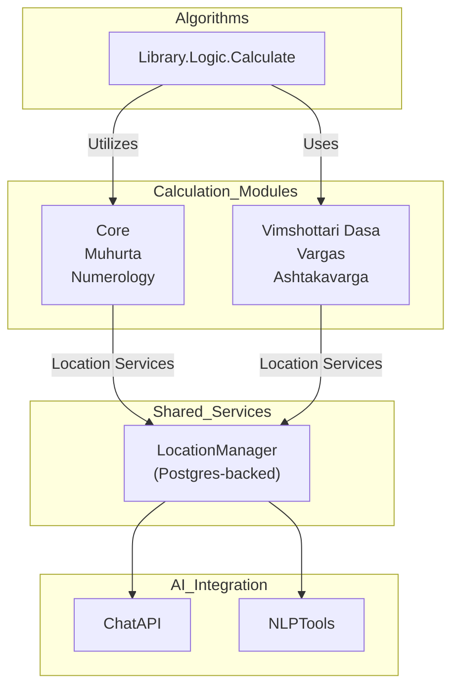

This section is unchanged by the migration. Planetary and house calculations
(`Library/Logic/Calculate/Core.cs`) cover houses owned by a planet, planets in houses, house
lords, planetary aspects/conjunctions/strength, sunrise/sunset, IshtaKaala, HoraAtBirth, etc.,
with results cached via `CacheManager.GetCache`.

`Ashtakavarga.cs` computes Prastaraka/Sarvashtakavarga/Bhinnashtakavarga charts.
`VimshottariDasa.cs` computes hierarchical Dasa/Bhukti periods (up to 8 levels).
`Vargas.cs` computes divisional charts (Hora D2, Navamsha D9, etc.) from precomputed tables.
`Muhurtha.cs` computes electional-astrology timings (Tarabala, Chandrabala, Panchaka, etc.),
using Pancha Pakshi data from `PanchaPakshi.cs`. `Numerology.cs` derives BirthNumber/
DestinyNumber/NameNumber via Chaldean numerology.

`ChatAPI.cs` integrates with LLMs for conversational predictions (now persisting chat history
to Postgres instead of Azure Table Storage — see [ChatMessageEntity](#data-persistence-with-postgres)).

## Astrological Chart and Report Generation

## Diagram 6

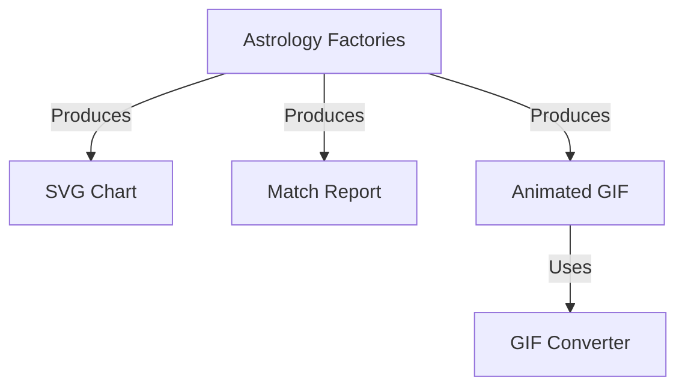

The project employs a factory pattern (`Library/Logic/Factory/*.cs`) to generate charts and
reports, primarily as SVG, with animated-GIF support for event timelines.

`EventsChartFactory.cs` creates SVG event-timeline charts. `MatchReportFactory.cs` computes
Vedic compatibility (Kuta) reports between two people. `SkyChartFactory.cs` produces sky charts
(zodiac ruler, houses, planet positions along the ecliptic) and can render an animated GIF by
sequencing SVG frames. `IndianChartFactory.cs` (formerly split across `NorthChartFactory.cs`/
`SouthChartFactory.cs`) renders South/North Indian style Kundali charts.

### Sky Chart

`Calculate.SkyChart(Time time)` (`Library/Logic/Factory/IndianChartFactory.cs`) is a thin
wrapper around `SkyChartFactory.GenerateChart(time, 750, 230)` — a fixed 750x230 landscape
canvas (this ratio matters: it's a horizontal ruler/timeline, not a square grid, and the
Horoscope page's `SkyChartViewer.tsx` sizes its container to match this aspect ratio rather than
forcing a square). `GenerateChart` assembles the SVG from several independently-generated
sub-components, concatenated in this order:
1. **Angle ruler** (`GenerateAngleRuler`) — a 0-360° degree scale drawn as tick marks across the
   canvas width, with a text label every 10°.
2. **Zodiac ruler** (`GenerateZodiacRuler`) — the 360° zodiac band image
   (`Resources/SkyChart/zodiac-360.svg`, an embedded assembly resource, not fetched over HTTP)
   scaled to the canvas width.
3. **House ruler** (`GenerateHouseRuler`) — calls `Calculate.AllHouseLongitudes(time)` to find
   each house's start/end longitude, then paints a small "HOUSE {n}" badge at that house's
   position along the ruler.
4. **Planet icons** (`GetAllPlanetLineIcons`) — for each planet's longitude
   (`Calculate.AllPlanetLongitude(time)`), draws a vertical line down from the ruler to an icon
   (the Moon's icon additionally varies by lunar day, via `Calculate.LunarDay`). Icons that would
   collide horizontally are stacked onto separate rows (`incrementRate` vertical offset per row)
   instead of overlapping.
5. **Border** (`GetBorderSvg`) — a single rounded-rect outline around the whole canvas.

All of the above per-icon SVGs (`Tools.GetSvgIconLocal`/`FormatSvgIcon` in `Library/Logic/
Tools.cs`) are flattened into `<g transform="...">` groups with an explicit scale/translate
(and any Illustrator-exported `<style>` class rules inlined as `style=""`) before being spliced
into the parent SVG — never left as a nested `<svg>` or a `class=` attribute. This matters
because the SVG is rendered client-side by `react-native-svg`'s `SvgUri` (see the Frontends
section below), which maps SVG XML directly onto native/DOM elements and does not support a
nested `<svg>` (it gets silently dropped) or a bare `class` attribute (logs an "Invalid DOM
property `class`" warning on web and does nothing on native).

### Birth Chart (Indian Chart)

`Calculate.SouthIndianChart(time, chartType)` / `NorthIndianChart(time, chartType)`
(`Library/Logic/Factory/IndianChartFactory.cs`) render a 480x480 square Kundali grid: a 4x4 grid
of cells framed by an orange picture-frame border with corner tabs, 12 of the cells are houses
(each with a house-number badge, the zodiac sign it's in, and the planets occupying it) and the
4 center cells merge into one title cell naming the chart (e.g. "Rasi D1", "Navamsha D9").
`chartType` (the `ChartType` enum, `Library/Data/Enum/ChartType.cs`) selects which divisional
chart (`D1`-`D60`) to compute and defaults to `RasiD1` if the caller omits it. South vs North
Indian style only changes which houses are fixed vs rotate with the ascendant
(`northIndianStyle` flag into the shared `GenerateIndianChartSvg`); the house/planet/sign
computation itself is identical either way.

Both chart endpoints, like every `Calculate/*` endpoint, also accept a trailing
`Ayanamsa/{value}` URL segment (e.g. `.../ChartType/NavamshaD9/Ayanamsa/RAMAN`) — this is a
global convention handled by `API/FrontDesk/OpenAPI.cs`'s `ParseAndSetAyanamsa`, which strips it
out of the URL and sets `Calculate.Ayanamsa` before the reflection-dispatched method is invoked,
so it works for any endpoint without that endpoint declaring an `ayanamsa` parameter itself. The
Horoscope page's frontend (`WebsiteNative/src/lib/api/horoscope.ts`'s
`getIndianChartImageUrl`) uses this to render two Birth Charts side by side per person — the
natal `RasiD1` chart and the `NavamshaD9` (marriage/D9) chart — both against the same
`SouthIndianChart`/`NorthIndianChart` endpoint, differing only by the `ChartType` segment.

**Important caveat specific to this session's work:** `IndianChartFactory.cs`'s doc comment
notes it was *"reconstructed from scratch"* — the original chart-drawing implementation was
never actually committed to git in this repo; only its auto-generated API documentation
metadata survived (`Library/Data/OpenAPIStaticTable.cs`). This is unrelated to the Postgres
migration itself, but is worth flagging as a gap in the codebase's history: the "before" state
this doc's Azure-version sibling describes for `NorthChartFactory`/`SouthChartFactory` is only
approximately reconstructed, not restored verbatim. During this session, three concrete bugs
in this reconstructed code were found and fixed (see
[Known Migration Gaps](#known-migration-gaps-pending-phase-4) for the full list):
a required-but-unsent `ChartType` URL parameter that broke every Birth Chart request; a
`SkyChartFactory` per-house-icon template that embedded two complete SVG font definitions
**twelve times** (once per house marker), inflating a single chart response to ~4.6MB; and a
`GetAllPlanetLineIcons` row-stacking bug (`incrementRate` hardcoded to `0`) that caused
same-row planet icons to render on top of each other.

GIF encoding/decoding (`Library/Logic/GIFConverter/*.cs` — `AnimatedGifEncoder`, `NeuQuant`,
`LZWEncoder`, `GifDecoder`) is unchanged.

### Life Events Chart & Smart Summary Tooltip

`EventsChartFactory.cs` generates the horizontal life-event timeline used by `LifePredictor` and
`GoodTimeFinder` (`GET /api/EventsChart/{specs}`, `API/FrontDesk/EventsChartAPI.cs`) as one large
SVG string — a stack of per-Dasa-level event rows, plus a bottom "Smart Summary" color row
(`GenerateSummaryRow`) whose per-pixel-column fill color is a red→green gradient of that column's
combined `NatureScore`.

In the original Blazor site, hovering the mouse over this chart drove an interactive tooltip via
a hand-rolled client-side library (`Website/wwwroot/js/EventsChart.js`, since deleted from the
repo — recovered from git history for this work): a vertical cursor line followed the mouse,
and a legend box listing every event active at that x-position was cloned from an SVG template
and populated by reading data attributes (`eventname`, `eventdescription`, `naturescore`, `age`,
`stdtime`) directly off the `<rect>` elements at that column, found via
`$(ID.EventChartHolder).children().find('[x=' + mouseRoundedX + ']')`. **This entire interactive
layer was dropped, not ported**, when `WebsiteNative` switched to rendering the same raw SVG
string via `react-native-svg`'s `SvgXml` — `SvgXml` renders static markup only, it has no DOM to
attach jQuery/tippy.js event handlers to, and there is no direct RN equivalent of either library.
The chart was visible but inert until this gap was closed:

- **Backend addition** — `foundEvent`'s existing `SpecializedSummary` (Mind/Studies/Family/Money/
  Love/Body, each an `EventNature` + `Weight`, populated per-event at static-data-generation time
  in `EventDataListStatic.cs`/`HoroscopeDataListStatic.cs` — see
  [Astrological Data Structures](#astrological-data-structures)) was never actually surfaced
  anywhere in the chart output, in either the old or new frontend. `EventsChartFactory.cs`'s
  `GenerateMultipleRowSvg` now also emits it per event-rect as a new `summarycategories`
  attribute (`FormatSummaryCategories`), a compact `"Category:Nature:Weight"` CSV (e.g.
  `"Family:Good:2,Money:Good:1,Body:Bad:1"`, Neutral/Empty categories omitted) alongside the
  pre-existing `eventname`/`eventdescription`/`naturescore`/`age`/`stdtime` attributes. This
  required no new endpoint and no LLM call at request time — the data was already computed, just
  never wired to the wire format.
- **Frontend re-implementation** (`WebsiteNative/src/lib/api/eventsChart.ts`,
  `src/components/EventsChartViewer.tsx`) — since there's no DOM to query, `parseEventRects()`
  regex-parses every `<rect eventname="..." .../>` out of the raw SVG string once per fetch (the
  same per-event data the old jQuery selector read, just off a string instead of a live DOM).
  `buildSmartSummary()` aggregates the `summarycategories` of every rect whose x-span contains
  the cursor position into one templated sentence (positive categories → phrases like "family
  growth"/"financial gains", weighted by summed `Weight`, joined with an Oxford comma; negative
  categories appended as a "despite ..." clause) — a condensed single-sentence replacement for
  the old per-event legend list, not a per-event enumeration.
  `EventsChartViewer.tsx` overlays a transparent gesture-capture `View` on top of `SvgXml` inside
  the horizontally-scrolling content (so pointer/touch coordinates land directly in the same
  pixel space as the `<rect>` `x`/`width` attributes, no scroll-offset math needed): real mouse
  hover (`onMouseMove`, web-only) drives it on desktop, while touch-drag (`onTouchStart`/
  `onTouchMove`, works on native iOS/Android and mobile web alike) substitutes for hover on
  touchscreens, which have no hover concept. Both render the same vertical cursor line + floating
  blue Smart Summary box (time/age label above, sentence below) positioned under the touch/cursor
  x-coordinate.

Wiring this up surfaced the same class of bug already documented for `SkyChartFactory` (gap #16
below), independently in `EventsChartFactory.cs`: its `<svg>`/`<g>`/`<rect>` wrapper elements
(the outer holder, content group, border rect, and per-row group) carried bare `class="..."`
attributes (`EventChartHolder`, `EventChartContent`, `EventChartBorder`, `EventListHolder`, plus
`WrapSvgElements`'s own `svgClass` parameter — a separate code path shared with
`BirthTimeFinderAPI.cs`/`Console/Program.cs`) left over from the old jQuery-selector-based JS
layer. `react-native-svg`'s `SvgXml` renders these onto `react-native-web` DOM elements, which
logs "Invalid DOM property `class`. Did you mean `className`?" for each one — harmless (it's a
web console warning, not a native crash) but noisy enough to surface as an error overlay in Expo
web dev. Removed at the source, same fix as gap #16: these attributes were only ever JS-selector
hooks, nothing in the SVG's own `style=""` attributes depends on them.

### GoodTimeFinder (electional/muhurtha search)

GoodTimeFinder was never a distinct backend feature in either the old or new architecture — in
both, it's a filtered *view* over the same `EventsChartFactory`/`EventsChart` engine
`LifePredictor` uses (see
[Life Events Chart & Smart Summary Tooltip](#life-events-chart--smart-summary-tooltip) above),
differing only in which `EventTag`s are selected and in UI defaults. Confirmed by searching
`Library/` for a dedicated `GoodTimeFinder`/`FindGoodTime`/`AuspiciousTime` calculator — the only
hit is a doc-string entry in `Library/Data/OpenAPIStaticTable.cs`, not a real method.

**Old**: `Website_Mobile/GoodTimeFinder.html` + `Website_Mobile/js/GoodTimeFinder.js` — a
`PersonSelectorBox`, a `TimeRangeSelector` (default `1month`), an `EventsSelector` checkbox tree
(`General, Personal, Agriculture, Building, Astronomical, BuyingSelling, Medical, Marriage,
Travel, Studies, HairNailCutting`, default-selected `General, Personal` — muhurtha/electional
event categories, e.g. weddings/travel/medical/hair-cutting, **not** Dasa periods), an Advanced
panel (Ayanamsa, days-per-pixel precision, algorithm checkboxes, default `General`), calling the
shared `EvensChartViewer`/`EventsChart` class in `Website_Mobile/js/VedAstro.js` against
`GET {ApiDomain}/EventsChart/{personId}/{timeRangeUrl}/{daysPerPixel}/{selectedEventTags}/
{selectedAlgorithms}/Ayanamsa/{selectedAyanamsa}` — the checkbox tree itself is populated from a
separate `GET {ApiDomain}/Calculate/GetAllEventDataGroupedByTag` call. The still-live Blazor port
(`Website/Pages/Calculator/GoodTimeFinder.razor`) is richer: 14 `EventTag` checkboxes (adds `Dasa`,
`Gochara`), a full `Algorithm.AllMethods` checkbox list (though `OnClickCalculate` hardcodes
sending only `Algorithm.General` regardless of which boxes are checked — a pre-existing quirk,
not introduced by this migration), a custom year/age-range option, and a default time-range preset
of `3month` (a third, different default from the mobile-web page's `1month`).

**Status: fixed.** `WebsiteNative/src/app/GoodTimeFinder.tsx` was originally a self-documented
*"simplified port"* that rendered `<EventsChartViewer apiUrlDirect person preset />` with no
options — identical to `LifePredictor.tsx`'s call, which meant both screens silently fell through
to the same hardcoded default in `eventsChart.ts` (`'PD1,PD2,PD3,PD4,PD5,PD6,PD7'`, LifePredictor's
Dasa-period default) and **rendered identical chart content**, a real behavioral regression (see
[Known Migration Gaps](#known-migration-gaps-pending-phase-4) item 18 for the original finding).
This has been fixed by restoring full parity with the verified old implementation — confirmed
directly from `git show HEAD:Website_Mobile/GoodTimeFinder.html`/`js/GoodTimeFinder.js` and
`Website/Pages/Calculator/GoodTimeFinder.razor` (the still-live Blazor page), **not** from a
plausible-sounding but inaccurate description of the page that surfaced mid-session (it described
a `DateSelector`/`StartHour`/`EndHour`/`PrecisionInput` UI and an `EventsAtRange` endpoint — none
of which exist anywhere in the repo's history on any branch, confirmed by also checking
`github.com/VedAstro/VedAstro`'s master branch directly; the real old UI is `TimeRangeSelector` +
`EventsSelector` + an Ayanamsa/precision/algorithm Advanced panel, exactly as this section
describes).

- `WebsiteNative/src/constants/eventsChartOptions.ts` (new) — `EVENT_TAG_OPTIONS` (the 13
  checkboxes `GoodTimeFinder.razor` renders: `General, Personal, Agriculture, Studies, Building,
  Travel, Astronomical, Marriage, BuyingSelling, HairNailCutting, Medical, Dasa, Gochara`, with
  `Studies`/`Building` flagged `comingSoon` per the Blazor page's own tooltip text),
  `GOOD_TIME_FINDER_DEFAULT_EVENT_TAGS` (`General, Personal` — the old JS's own default, restoring
  the differentiation from LifePredictor), `ALGORITHM_OPTIONS` (the 10 `Algorithm.AllMethods`
  method names from `Library/Logic/Algorithms.cs`), `GOOD_TIME_FINDER_DEFAULT_ALGORITHMS`
  (`General`, per the old JS comment *"only uses Raman for Muhurtha"*), and `MONTH_OPTIONS` for the
  custom-range month picker.
- `WebsiteNative/src/lib/api/eventsChart.ts` gained `getEventsChartSvgCustomRange` +
  `CustomRange` type (an explicit Year/Month start/end pair, mirroring
  `ViewComponents/Components/MonthYearTimeRangeSelector.razor`'s granularity exactly — start = 1st
  of the month at 00:00, end = last calendar day of the end month, device-local timezone offset
  rather than the birth location's, matching `Tools.GetSystemTimezoneStr()`'s old behavior) and
  `computeDaysPerPixelForPreset`/`computeDaysPerPixelForCustomRange` (auto-fill for the Precision
  field, editable afterwards — same UX as `DaysPerPixelInput`/`DayPerPixelInput` auto-recalculating
  on range change in both old implementations). Confirmed via `Library/Data/EventsChart.cs`'s
  `FromUrl` that an explicit Start/End URL segment (`processType1`) is a fully independent code
  path from the preset segment (`processType2`) — no server-side change was needed to support a
  custom range.
- `WebsiteNative/src/components/EventsChartViewer.tsx` gained optional `customRange`,
  `eventTagsCsv`, `algorithmNamesCsv`, `ayanamsaName`, `daysPerPixelOverride` props, so any screen
  can now override every option `EventsChart.cs`'s URL accepts instead of only `person`+`preset`.
- `GoodTimeFinder.tsx` now renders the EventTag checkbox chips (default `General, Personal`), a
  preset-or-custom time-range toggle, and a collapsible Advanced panel (Ayanamsa `Dropdown` reusing
  the existing `AYANAMSA_GROUPS`, Algorithm checkboxes, editable Precision field) — reproducing the
  old page's `IsValid()`/`OnClickCalculate()` checks (person selected, ≥1 tag, ≥1 algorithm, valid
  custom-year input) via `showErrorToast`.
- `LifePredictor.tsx` now explicitly passes its own `eventTagsCsv`/`algorithmNamesCsv`
  (`PD1..PD7`/`General`) into `EventsChartViewer` rather than relying on `eventsChart.ts`'s
  implicit default — so the two screens can no longer silently reconverge on identical chart
  content the way they did before this fix.

**Known deviation kept from the old page, not reintroduced:** the live Blazor
`GoodTimeFinder.razor:520-554`'s `OnClickCalculate` actually hardcodes sending only
`Algorithm.General` to the chart regardless of which Algorithm checkboxes are checked (a
pre-existing Blazor-side inconsistency between its own default-checked boxes and what it actually
submits) — the restored WebsiteNative screen instead sends whatever algorithms are actually
checked, matching the simpler and internally-consistent behavior of the original
`Website_Mobile/js/GoodTimeFinder.js`.

**A second, more severe bug was found and fixed in the same area, reported directly against the
live Blazor site**: clicking any `+1/+3/+5/+10 Year` preset showed a range whose start was
correctly the birth time but whose end was `DateTime.Now + N years` instead of `birth + N years`.
Two compounding root causes:

1. `Calculate.AutoCalculateTimeRange` (`Library/Logic/Calculate/CoreMisc.cs`) only matched presets
   ending in the **plural** suffix (`"years"`), while `TimeRangeSelector.getSelectedTimeRangeAsURLString()`
   (confirmed directly from `github.com/VedAstro/VedAstro`'s `Website_Mobile/js/VedAstro.js:5985-6018`)
   always sends the **singular** form (`"1year"`, `"3year"`, no trailing `s`) — every preset click
   silently missed the match and fell through to the unrecognized-preset default
   (`birth + 100 years`, i.e. "full life"). Fixed to accept both singular and plural unit suffixes
   (`day(s)`, `week(s)`, `month(s)`, `year(s)`), and added `"1day"` handling (previously unhandled
   entirely, despite being the dropdown's first non-custom option).
2. Fixing only (1) still didn't match the reported expectation: the resulting behavior was
   `birth → birth+N`, but for a person born 01/01/1980, clicking "+1 Year" today was expected to
   show *today..+1 year* — a forward-looking Muhurta/forecast window, not the person's first year
   of life. The correct semantics (confirmed by the reporter after this second fix): `"age1to10"`,
   `"fulllife"`, and literal year-range presets stay birth-anchored (inherently about the person's
   life span), but every `"Nday(s)"/"Nweek(s)"/"Nmonth(s)"/"Nyear(s)"` preset should anchor on the
   **current moment**, using birth only for `GeoLocation` context.

Both fixes were applied in **two places**, since WebsiteNative doesn't call
`AutoCalculateTimeRange` at all — it computes Start/End client-side (see above) and only shares
the *semantics*, not the code path:
- `Library/Logic/Calculate/CoreMisc.cs` — the still-live Blazor pages' server-side `/TimePreset/`
  path.
- `WebsiteNative/src/lib/api/eventsChart.ts`'s `resolvePresetRange` — WebsiteNative's client-side
  path (used by both `GoodTimeFinder.tsx` and `LifePredictor.tsx` via `getEventsChartSvg`).

Regression tests: `LibraryTests/Logic/Calculate/CoreMiscTests.cs`. Aside, found while chasing
this: `AutoCalculateTimeRange`'s real production implementation could not be found committed under
any name in a full clone of `github.com/VedAstro/VedAstro`'s master branch — only *callers* exist
there (`EventsChart.cs`, `LifePredictor.razor`, `GoodTimeFinder.razor`). Same "reconstructed, not
restored" situation as `IndianChartFactory` (see below) — this repo's version is a best-effort
reconstruction, not a verbatim restore.

Still no dedicated integration test exists for GoodTimeFinder specifically —
`API/API.IntegrationTests/EventsChartEndpointsTests.cs` exercises the shared `/api/EventsChart`
endpoint generically (one test case using tags `Gochara,General`), but nothing named
"GoodTimeFinder" or asserting muhurtha-style tag behavior. Not addressed by this fix.

(`API/FrontDesk/BirthTimeFinderAPI.cs`'s `/api/FindBirthTime/EventsChart/...` is unrelated despite
the naming similarity — it's for birth-time rectification search over unknown birth times, not
electional/muhurtha search, and should not be conflated with GoodTimeFinder.)

### Match / Compatibility Reports (MatchChecker → WebsiteNative)

The Vedic compatibility ("Kuta"/Ashtakoot) feature was audited end-to-end this session and
confirmed **fully ported**, with the calculation core untouched: `MatchReportFactory.cs`
(`Library/Logic/Factory/MatchReportFactory.cs`) already implemented the full classical
Ashtakoot/Guna-Milan calculators (`Mahendra`, `NadiKuta`, `GunaKuta`, `Varna`, `YoniKuta`, `Vedha`,
`VasyaKuta`, `DinaKuta`, `RasiKuta`, `RajjuKuta`, `StreeDeergaKuta`, `GrahaMaitri`, plus the
neutralization/exception rules and the 36-point-to-percentage `CalculateTotalPoints`) before the
migration and needed no changes — only its callers moved from Azure Functions/Azure Table Storage
to the new stack.

`API/FrontDesk/MatchAPI.cs` exposes four Postgres-backed endpoints, wired into `API/Program.cs`'s
`MapMatchEndpoints`:

- `GET /api/FindMatch/PersonId/{personId}` — cross-checks one person against every saved person
  in the database, filters to `KutaScore >= 70`, returns a `PersonKutaScore` list. Ports the old
  `Website_Mobile/MatchFinder.html`/`MatchFinder.js` "search the whole database for matches"
  feature.
- `GET /api/GetMatchReport/MaleId/{maleId}/FemaleId/{femaleId}` — one-on-one report via
  `MatchReportFactory.GetNewMatchReport`, the direct successor of the old
  `Calculate/MatchReport/{maleBirthTimeUrl}{femaleBirthTimeUrl}` endpoint used by
  `Website_Mobile/js/MatchChecker.js`'s `OnClickCalculateMatch()`. **One deliberate shape change**:
  the old endpoint took two raw birth-time URL segments (`BirthTime.ToUrl()`) directly, so a
  compatibility check never required either person to be a saved record; the new endpoint looks
  both people up by ID (`Tools.GetPersonById`), so a "quick check without saving either person"
  path no longer exists server-side. Worth confirming with the team whether this was an
  intentional scope narrowing.
- `POST /api/SaveMatchReport` / `GET /api/GetMatchReportList/OwnerId/{ownerId}` — **new**
  persistence, backed by `Data/Entities/SavedMatchReportEntity.cs` (migration
  `AddSavedMatchReportTable`). This "saved matches" capability did not exist server-side in the
  old Blazor/Azure-Functions site at all — it's a net-new feature added during the migration, not
  a straight port.

All four are covered by `API/API.IntegrationTests/MatchEndpointsTests.cs` (FindMatch golden path,
GetMatchReport golden path, SaveMatchReport → GetMatchReportList round-trip including
re-save-updates-notes behavior).

On the frontend, `WebsiteNative/src/app/Match/` mirrors the old pages 1:1: `index.tsx` (person
selection + validation, porting `Website/Pages/Calculator/Match/Index.razor` and
`Website_Mobile/MatchChecker.html`'s two `PersonSelectorBox` widgets, including the same "Marriage
Karma"/"Imagine Perfect Marriages" prose carried over from the old SEO page
`Website/wwwroot/seo/Match/index.html`), `Finder.tsx` (database-wide search — intentionally drops
the old page's dead, unreachable `OnClickSearchButtonOLD` no-login email-capture fallback, since
it was unreachable code even before the migration), `Report/[maleId]/[femaleId].tsx` (easy-summary
+ advanced Kuta-table report, the equivalent of `easyMatchReportHolder`/`advancedMatchReportHolder`
in the old HTML), and `Saved.tsx` (new screen for the new saved-reports feature).
`WebsiteNative/src/lib/api/match.ts` is the typed client wrapping all four endpoints, with inline
comments cross-referencing which old feature each call corresponds to. `Website/Pages/Calculator/
Match/*.razor` (the Blazor site) already targets these same new endpoints
(`ViewComponents/Code/API/MatchTools.cs`), so it isn't stuck on the old Azure API either.

One minor, content-only gap: `Website_Mobile/MatchCheckerExplanation.html` (the old detailed "16
astrological factors" explainer page, linked from the old MatchChecker page) has no standalone
equivalent in `WebsiteNative` — only its summary text made it into `index.tsx`'s info box.

## Geographical Location and Timezone Management

## Diagram 7

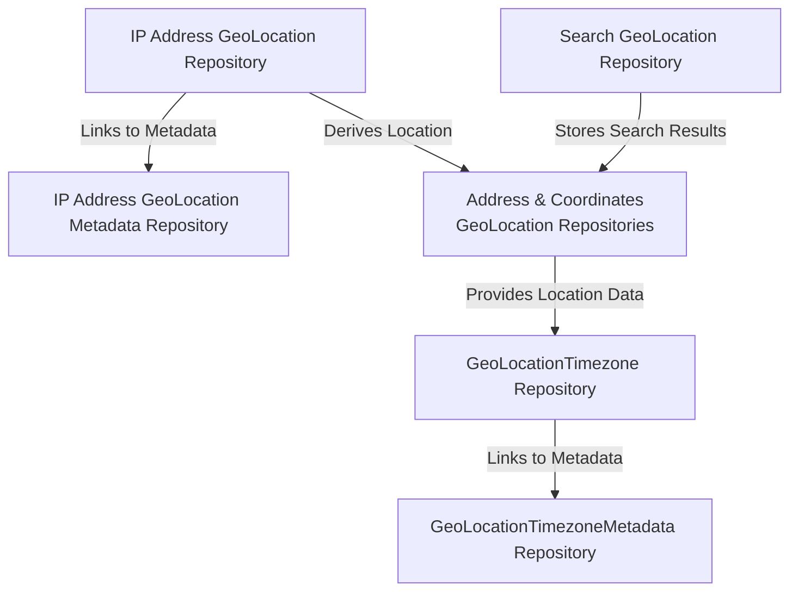

The system manages geographical locations and timezones through **Postgres tables** (via the 7
repositories listed in [Data Persistence with Postgres](#data-persistence-with-postgres)),
replacing the old Azure Table Storage entities 1:1 in shape (same `PartitionKey`/`RowKey`-style
lookup semantics, preserved via the `IPartitionRowKeyEntity` interface in
`Data/Entities/IPartitionRowKeyEntity.cs` so the access pattern didn't need to change, only the
backing store).

Address-based, coordinate-based, IP-based, and search-result geolocation lookups are all
cached this way to minimize redundant external geocoding API calls. Timezone data (standard
offset, DST rules) is similarly cached, keyed by coordinates. This is functionally identical to
the pre-migration design described in the Azure-version doc — only the storage engine changed.

## Event Management and Delegation

Unchanged by the migration. `AlgorithmFuncs`, `EventCalculatorDelegate`,
`HoroscopeCalculatorDelegate` (`Library/Data/Delegate/CalculatorDelegates.cs`), and
`EventGenerator` (`Library/Data/Delegate/EventGenerator.cs`) standardize calculation/generation
method signatures across the engine, enabling `AutoCalculator`
(`Library/Logic/AutoCalculator.cs`) to discover and invoke them via reflection.

## API Services and Data Management

## Diagram 8

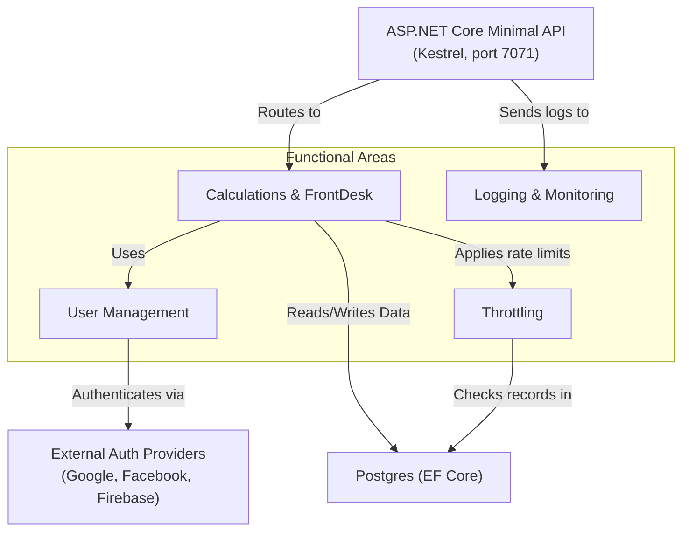

The API (`API/` directory) is now an **ASP.NET Core minimal API** (`API/API.csproj`, SDK
`Microsoft.NET.Sdk.Web`), running on Kestrel and bound to `http://localhost:7071` in
development (`API/Program.cs`). There is no Azure Functions SDK, no `[Function]`/`[FunctionName]`
attributes, and no `host.json`/`function.json` anywhere in this project.

Data persistence is via **Postgres through EF Core** (`AppDbContext`, registered with
`AddDbContextFactory<AppDbContext>(...UseNpgsql(...))` in `API/Program.cs`), covering
analytics, call-status tracking, geolocation caching, error logging, and general API logs — see
[Data Persistence with Postgres](#data-persistence-with-postgres) for the entity mapping.

### API Endpoint Design and Implementation

The reflection-based dynamic dispatcher (`API/FrontDesk/OpenAPI.cs`) is unchanged in design: a
generic `Calculate/{calculatorName}/{*fullParamString}` route reflects onto matching methods in
`Calculate`/`PersonAPI`, parsing compulsory then optional URL parameters. `PersonAPI.cs`
(add/update/delete/get person records, visitor→user data migration on login),
`WebsiteLoggerAPI.cs` (client-side error/debug logging), `BirthTimeFinderAPI.cs`,
`EventsChartAPI.cs`, and `MatchAPI.cs` all still exist with the same responsibilities as
before — only their data access underneath was repointed at Postgres repositories.

### API Authentication and User Management

Authentication now supports **three** methods, not two:

- `GET /api/SignInGoogle/Token/{token}` — `GoogleJsonWebSignature.ValidateAsync` (unchanged).
- `GET /api/SignInFacebook/Token/{token}` — Facebook Graph API token validation (unchanged).
- `GET /api/SignInFirebase/Token/{token}` — **new**, `FirebaseAuth.DefaultInstance.VerifyIdTokenAsync`
  (`FirebaseAdmin` NuGet package). This verifies tokens produced by `WebsiteNative`'s sign-in
  flow, which drives Google/Facebook OAuth via `expo-auth-session` and then exchanges the
  resulting token for a Firebase credential client-side, rather than sending the raw
  Google/Facebook token straight to the API the way the Blazor site does.

All three funnel into the same `AddOrUpdateUserData` helper and the same Postgres `UserData`
table (`Data/Entities/UserDataListEntity.cs`) — one shared user identity regardless of which
frontend or provider a user signs in through.

### API Throttling and Rate Limiting

Unchanged in design (`API/ThrottleManager.cs`): browser and valid-API-key requests proceed at
full speed; anonymous IP requests are rate-limited against a configurable per-60-second
threshold. Call records (`AnonymousIpCallRecordEntity`, `SubscriberCallRecordEntity`) are now
Postgres rows via `IAnonymousIpCallRecordRepository`/`ISubscriberCallRecordRepository`, replacing
the old `AzureTable.AnonymousIpCallRecords`/`SubscriberCallRecords` tables.

### API Logging and Error Reporting

Unchanged in design. `APILogger` (`API/ApiLogger.cs`) logs exceptions (caller IP, URL, branch,
exception JSON) — now to `Data/Entities/OpenAPIErrorBookEntity.cs` via
`IOpenAPIErrorBookRepository`, instead of Azure Table Storage. `WebsiteLoggerAPI.cs`'s
client-error/debug endpoints now persist to `Data/Entities/WebsiteLogEntities.cs`
(`IWebsiteErrorLogRepository`/`IWebsiteDebugLogRepository`).

## Frontends: Desktop, Web, and Mobile

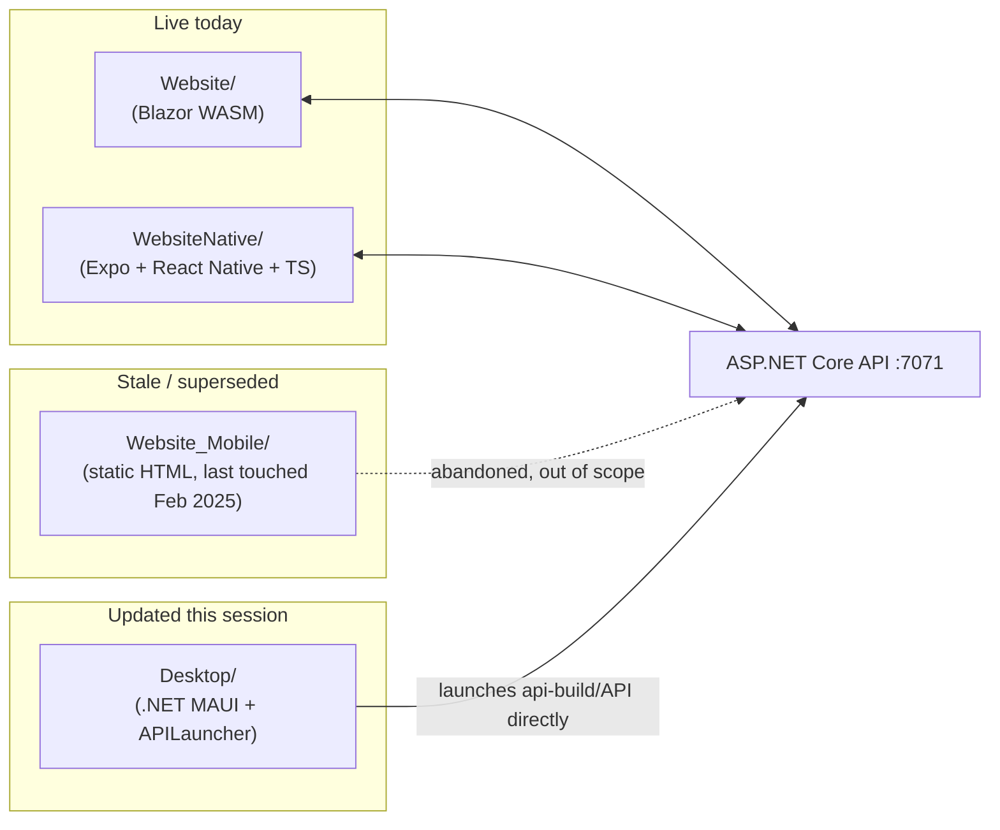

**`Website/`** — the Blazor WebAssembly frontend, still the current production frontend during
the Phase 3 transition. Unchanged: still directly integrates the Facebook JS SDK and Google API
JS for sign-in (`Website/wwwroot/index.html`).

**`WebsiteNative/`** — a **new** React Native (Expo SDK ~57) + TypeScript app, not present at all
in the pre-migration architecture. Uses `expo-router` file-based routing, React 19/RN 0.86,
Zustand for state, and the Firebase SDK for auth. Its routes under `src/app/` mirror `Website/`'s
calculator and account pages 1:1 (Horoscope, Match, BirthTimeFinder, GoodTimeFinder, Numerology,
Account/Person management, Journal, Blog, legal pages, etc.), talking to the same ASP.NET Core
API. `migration.md` explicitly designates this as the intended replacement for both `Website/`
and `Website_Mobile/`, run side-by-side with the old frontend during the transition rather than
cut over all at once. Chart/table components render server-produced SVGs via
`react-native-svg`'s `SvgUri` (not React Native's built-in `Image`, which only decodes SVG on
web — see the [Known Migration Gaps](#known-migration-gaps-pending-phase-4) note on this bug,
found and fixed during this session).

**`Website_Mobile/`** — the old mobile-optimized static-HTML/JS frontend. Explicitly marked
*"untouched, out of scope"* in `migration.md`; last git commit February 2025, over a year stale
relative to `WebsiteNative`'s active daily development. Superseded, not maintained, not deleted
yet.

**`Desktop/`** — the .NET MAUI cross-platform desktop app. `Desktop/APILauncher/Program.cs` and
`Desktop/Windows/Form1.cs` used to shell out to `Azure.Functions.Cli/func.exe start`, which would
have failed outright once the API stopped building as an Azure Functions host. Fixed this
session (part of Phase 4 cleanup): both now launch a self-contained `API`/`API.exe` executable
directly from an `api-build/` folder next to the launcher, no Functions CLI involved. (The macOS
SwiftUI launcher's equivalent code was already fully commented out/inactive, so it was left as
historical reference rather than touched.)

## Machine Learning and Data Pipelines

The project incorporates ML/data components for astrological matching, planetary-data
distribution, and unstructured-text processing.

**`MatchMLPipeline/`** — generates and classifies compatibility-prediction datasets. Contrary
to an initial assumption that this directory would be untouched by the migration, it was
**actively repointed at Postgres**: `DatasetFactory.cs`'s own comment reads *"Postgres wiring
(replaces the old raw Azure Table Storage TableClient fields)"*, and it now builds an
`IDbContextFactory<AppDbContext>` directly (no DI host, since this is a standalone console
tool) against `Data/VedAstro.Data.csproj`. `PersonListEntity` remains the domain type name, but
it's now backed by `PersonRepository`, not Azure Table Storage. The `NearestCentroidClassifier`
and ILGPU-based GPU acceleration are unchanged. **One Azure dependency remains**: LLM extraction
calls still hit an Azure-hosted inference endpoint
(`https://Meta-Llama-3-70B-Instruct-*.inference.ai.azure.com`) — this is an external inference
API, not the storage layer the migration targeted, so it was left as-is.

**Why `MatchMLPipeline` should stay a separate, offline tool rather than being wired into the
live API:** it solves a genuinely different problem than the live Match feature (see
[Match / Compatibility Reports](#match--compatibility-reports-matchchecker--websitenative)
above). `MatchReportFactory` (called from `API/FrontDesk/MatchAPI.cs` on every request) computes
a deterministic, rules-based Ashtakoot/Guna-Milan Kuta score — no ML, no training data, no model
loading. `MatchMLPipeline`'s `NearestCentroidClassifier`, by contrast, is a statistical
marriage-*outcome* predictor (e.g. `ncc.LoadFromTable("marriagePredictMK1")` in `Program.cs`)
trained on LLM-extracted person/marriage/body-info datasets — an experimental, unvalidated
feature, not a replacement for or component of the Kuta calculation. Confirmed during this
session's audit: nothing in `API/`, `Website/`, or `Library/` (aside from the JSON-helper
extension methods in `Library/Logic/MatchMLDatasetEntityExtensions.cs`) references
`MatchMLPipeline`, `DatasetFactory`, or `NearestCentroidClassifier` — it is not on the live
request path today. Wiring a prediction endpoint into the API would mean committing to running
and maintaining an LLM data-extraction pipeline plus periodically retraining/reloading a model in
production, for a feature whose prediction quality hasn't been validated end-to-end. Keeping it
as a standalone console tool (`Main`/`Main2`/`Main5` in `Program.cs`) that writes to the same
Postgres database is the right shape until there's a concrete product decision to graduate it
into a live, user-facing prediction — at which point it would need its own dedicated API endpoint
and explicit product scoping, not an incidental wire-up.

**`HuggingFace/`** (planetary-data pull/push to the Hugging Face Hub) and **`DocToEmbeddings/`**
(PDF text extraction and hierarchical chunking) — both untouched, and never had an Azure
dependency to migrate away from.

## Utility and Automation Tools

Migration status varies per tool — some were actively updated, some were never Azure-coupled,
and two (`Publisher/`, and the API's own `Dockerfile`) are genuine leftovers pending Phase 4:

| Tool                      | Purpose                                                                 | Migration status                                                                                                                                                                                                                                          |
|---------------------------|-------------------------------------------------------------------------|-----------------------------------------------------------------------------------------------------------------------------------------------------------------------------------------------------------------------------------------------------------|
| `Console/`                | Finds optimal birth times, generates event-chart SVGs                   | Mostly updated — Azure Blob calls are now dead/commented (`Console/Program.cs`), though `Console.csproj` still carries an unused `Azure.Storage.Blobs` package reference (cleanup opportunity)                                                            |
| `LLMCoder/`               | WinForms LLM coding assistant                                           | Untouched, unrelated to the migration (its few "Azure" hits are `Color.Azure`, a WinForms color constant, not cloud services)                                                                                                                             |
| `MigrateGeoLocationData/` | Bulk-loads geo/timezone CSV data                                        | **Actively migrated** — `Program.cs` now uses EF Core + `Npgsql` against the same `AppDbContext`/`PersonRepository` as the API. The old Azure-Table-targeting code (`ProgramTimezone.cs`) is fully commented out, superseded rather than deleted outright |
| `WebScraper/`             | Python scraper for public astrological data (Astro-Seek.com)            | Unaffected — already POSTs to `http://localhost:7071/api/Calculate/AddPerson/...`, which is still the correct port/shape under the new Kestrel host                                                                                                       |
| `StaticTableGenerator/`   | Generates OpenAPI metadata, Python stubs, static data tables via Roslyn | Untouched, never had an Azure dependency                                                                                                                                                                                                                  |

## Deployment and Publishing

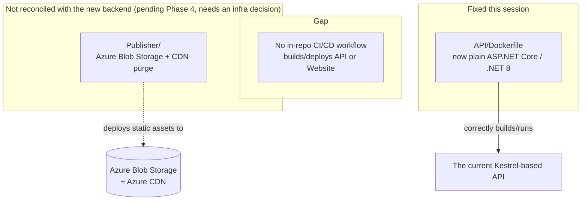

**The `Publisher/` situation documents a real, unreconciled gap; `API/Dockerfile` has since been
fixed (see below).**

`Publisher/` still deploys web assets entirely through **Azure Blob Storage + Azure CDN**:
`Program.cs` uses `Azure.Storage.Blobs`'s `BlobServiceClient`, syncs local folders to a blob
container, injects a SHA256 hash of `js/VedAstro.js` into `js/app.js` for cache-busting, and
purges the Azure CDN via `az cdn endpoint purge` shell calls. None of this was touched by the
Postgres migration. `migration.md`'s own "Decisions" section records the new hosting target as
**"self-hosted on local computer"** — so `Publisher/`'s Blob+CDN static-asset pipeline is not
just old, it actively describes a different hosting model than what the rest of this document
describes, and it isn't clear from the repo alone how (or whether) it's still used for
whatever currently serves the deployed API at `vedastroapi.azurewebsites.net` (per `CLAUDE.md`).
Left alone this session — the replacement deploy mechanism isn't something inferable from the
repo, it needs an explicit decision.

`API/Dockerfile` **was** similarly stale (Azure Functions isolated-worker base image,
`AzureWebJobsScriptRoot`/`AzureFunctionsJobHost__*` env vars, .NET 7 SDK) but has been rewritten
this session as a plain multi-stage build: `mcr.microsoft.com/dotnet/sdk:8.0` for build/publish,
`mcr.microsoft.com/dotnet/aspnet:8.0` for the runtime image, `dotnet API.dll` as the entrypoint,
port 7071 exposed. This also surfaced a related bug: `API/Program.cs` bound Kestrel with
`ListenLocalhost(7071)`, which only accepts loopback connections — inside a container, the
request arrives over the container's external network interface, not loopback, so this would
never have been reachable through Docker's port mapping regardless of the base image. Changed to
`ListenAnyIP(7071)` (still reachable via `localhost:7071` for local dev either way).

There is no other CI/CD configuration in this repository: the only GitHub Actions workflow
(`.github/workflows/UpdateLLMCodes.yml`) just mirrors the unrelated `LLMCoder/` folder to a
separate repo. Whatever currently deploys the API and Website to production is either a manual
process or lives outside this repository — this document can't confirm which.

## Known Migration Gaps (pending Phase 4)

A consolidated list of every stale-or-broken item found while producing this document, cross
referenced against `migration.md`'s own Phase 4 plan ("point hosting at the new stack, remove
Blazor project, remove remaining Azure SDK references and Azure Functions scaffolding"). None
of these were surprises exactly — they're the specific things Phase 4 is scoped to clean up —
but they weren't itemized anywhere before this audit. The safe, code-level items have since
been fixed; the ones requiring an infrastructure decision or premature to do mid-Phase-3 are
still open, marked below.

**Fixed:**

1. ~~`API/Dockerfile` still uses an Azure Functions isolated-worker base image and .NET 7 SDK~~
   — rewritten as a plain multi-stage `mcr.microsoft.com/dotnet/sdk:8.0` build /
   `mcr.microsoft.com/dotnet/aspnet:8.0` runtime image, `dotnet API.dll` entrypoint, port 7071.
   (This also surfaced a real bug in `API/Program.cs`: Kestrel was bound with `ListenLocalhost`,
   which only accepts loopback connections and would never have been reachable through Docker's
   port mapping — changed to `ListenAnyIP`.)
2. ~~`Desktop/` (APILauncher + Windows launcher) still shells out to
   `Azure.Functions.Cli/func.exe start`~~ — both now launch a self-contained `API`/`API.exe`
   executable directly from an `api-build/` folder; no Functions CLI involved. (The macOS
   SwiftUI launcher's equivalent code is already fully commented out/inactive, so it was left
   as historical reference rather than touched.)
3. ~~`Library/Data/AzureTable/MarriageTrainingDatasetEntity.cs` is dead, unreferenced code~~ —
   migrated to `Data/Entities/MatchMLDatasetEntities.cs` (`MarriageTrainingDatasetEntity` POCO +
   `IMarriageTrainingDatasetRepository`, table `marriage_training_dataset`,
   `GetEmbeddingsArray()` extension in `Library/Logic/MatchMLDatasetEntityExtensions.cs`), wired
   into `MatchMLPipeline/DatasetFactory.cs` alongside its sibling repos; the old Azure Table file
   was then deleted.
4. ~~`AzureCache.cs`'s class name is misleading~~ — renamed to `Library/Logic/ChartCache.cs`
   (`ChartCache` class), all three call sites (`PersonAPI.cs`, `EventsChartAPI.cs`) and
   surrounding doc comments updated.
5. ~~`Console.csproj` carries an unused `Azure.Storage.Blobs` package reference~~ — removed.

**Still open** (infrastructure decisions or premature while Phase 3 is in progress — deliberately
left alone):

6. **`Publisher/`** still deploys exclusively via Azure Blob Storage + Azure CDN, describing a
   hosting model (`migration.md` records the new target as "self-hosted on local computer")
   that no longer matches the rest of the architecture. Left alone pending an explicit decision
   on what the new deploy mechanism actually is — not something inferable from the repo alone.
7. **No CI/CD workflow in-repo** builds or deploys the API or Website for the new architecture.
8. **`Website_Mobile/`** is stale and unmaintained (last commit Feb 2025) but not yet deleted,
   despite being explicitly superseded by `WebsiteNative/`. Left alone — deleting a whole
   frontend is a real, hard-to-reverse call better made deliberately, not as incidental cleanup.
9. **DNS/hosting cutover to the new stack** — an infrastructure/ops action outside this repo.

**Also fixed this session** (chart-rendering bugs found while working on the Horoscope page,
unrelated to the Azure migration itself but worth keeping in the historical record):

10. **`Constellation` didn't implement `IToJson`** — any endpoint returning a bare
    `Constellation` serialized to `{}` over the wire.
11. **`IndianChartFactory.cs`'s `SouthIndianChart`/`NorthIndianChart`** required a `ChartType`
    URL parameter that no client ever sent, breaking every Birth Chart request outright —
    `chartType` now defaults to `ChartType.RasiD1`.
12. **`SkyChartFactory.cs`'s per-house-icon template** embedded two complete SVG font
    definitions once per house marker (12x duplication), inflating a single Sky Chart response
    to ~4.6MB — fonts removed, relies on the client's default sans-serif instead.
13. **`SkyChartFactory.cs`'s `GetAllPlanetLineIcons`** had its row-collision-avoidance
    `incrementRate` hardcoded to `0`, silently defeating the vertical-stacking logic and causing
    same-row planet icons to render on top of each other.
14. **`WebsiteNative`'s chart components** (`IndianChart.tsx`, `SkyChartViewer.tsx`) used React
    Native's built-in `Image` component for server-rendered SVGs, which only decodes SVG on web
    (via the browser) — not on native iOS/Android, where charts would render blank. Switched to
    `react-native-svg`'s `SvgUri`.
15. **`Calculate.SkyChart`'s wrapper reused the Birth Chart's `480x480` square `ChartSize`**
    instead of `SkyChartFactory`'s own historical `750x230` landscape dimensions (confirmed via
    `git log -p`) — squashing the ruler/timeline layout into a square. Fixed by giving SkyChart
    its own `750x230` constants and matching `SkyChartViewer.tsx`'s container `aspectRatio` to
    it instead of forcing `1`.
16. **`SkyChartFactory.cs` and the icon SVGs it injects (`Tools.GetSvgIconLocal`) used nested
    `<svg>` tags and `class="..."` attributes** — invisible in a browser ``, but
    `react-native-svg`'s `SvgUri` (used by `SkyChartViewer.tsx`/`IndianChart.tsx`, see #14) drops
    nested `<svg>` elements entirely and logs an "Invalid DOM property `class`" warning for bare
    `class` attributes on web. Fixed by flattening icon `<svg>` wrappers into `<g transform=...>`
    groups (preserving the same scale/center a nested `<svg>`'s default
    `preserveAspectRatio="xMidYMid meet"` would have given) and inlining any Illustrator
    `<style>` class rules as `style=""` attributes, in `Tools.FormatSvgIcon`.
17. **`EventsChartFactory.cs` had the same bare `class="..."` problem as #16, independently** —
    the outer `<svg>` holder, content `<g>`, border `<rect>`, per-row `<g>`, and
    `WrapSvgElements`'s `svgClass` parameter (shared with `BirthTimeFinderAPI.cs`/
    `Console/Program.cs`) all carried `class="EventChartHolder"`/`"EventChartContent"`/
    `"EventChartBorder"`/`"EventListHolder"`/`{svgClass}` attributes left over from the old
    jQuery-selector-based `EventsChart.js`. Found while wiring up `EventsChartViewer.tsx`'s new
    Smart Summary tooltip (see [Life Events Chart & Smart Summary Tooltip](#life-events-chart--smart-summary-tooltip)),
    since `SvgXml` logs the same "Invalid DOM property `class`" warning `SvgUri` does. Removed at
    the source — none of the SVG's own `style=""` attributes depended on these classes.
18. ~~`GoodTimeFinder.tsx` and `LifePredictor.tsx` render identical chart content~~ — neither
    passed an `eventTagsCsv` option into `getEventsChartSvg`, so both fell through to
    `eventsChart.ts`'s single hardcoded default (`'PD1,PD2,PD3,PD4,PD5,PD6,PD7'`, i.e. Dasa
    periods), which in the old app was specifically LifePredictor's default — GoodTimeFinder
    always sent muhurtha/electional event tags (`General`, `Personal`, etc.) instead. **Fixed**:
    `GoodTimeFinder.tsx` was rebuilt to full parity with the verified old implementation (EventTag
    checkboxes defaulting to `General, Personal`, Ayanamsa/Algorithm/Precision Advanced panel,
    custom Year/Month range), and `LifePredictor.tsx` now passes its `PD1-PD7`/`General` defaults
    explicitly so the two screens can't silently reconverge again. See
    [GoodTimeFinder](#goodtimefinder-electionalmuhurtha-search) above for the full writeup.
19. **Two compounding bugs in `+1/+3/+5/+10 Year`-style presets, found via a live bug report
    against the deployed Blazor `GoodTimeFinder` page:**
    - **Singular vs. plural suffix mismatch** — `Calculate.AutoCalculateTimeRange`
      (`Library/Logic/Calculate/CoreMisc.cs`) only matched presets ending in the plural suffix
      (`"years"`), while the real UI always sends singular (`"1year"`) — every preset click
      silently missed the match and fell through to the unrecognized-preset default. Fixed to
      accept both singular and plural unit suffixes (`day(s)`/`week(s)`/`month(s)`/`year(s)`).
    - **Wrong anchor for the fallback-corrected presets** — an initial fix (kept both start and
      end anchored on birth: `birth → birth+N`) still didn't match the reported expectation: for a
      person born 01/01/1980, clicking "+1 Year" today should show *today..+1 year* (a
      forward-looking Muhurta/forecast window), not `01/01/1980..01/01/1981` (their first year of
      life). Fixed by anchoring the `"Nday(s)"/"Nweek(s)"/"Nmonth(s)"/"Nyear(s)"` branch on the
      current moment instead of birth (birth is still used for `GeoLocation` context only);
      `"age1to10"`, `"fulllife"`, and literal year-range presets remain birth-anchored, since those
      are inherently about the person's life span. Applied in both
      `Library/Logic/Calculate/CoreMisc.cs` (the still-live Blazor pages' server-side path) and
      `WebsiteNative/src/lib/api/eventsChart.ts`'s `resolvePresetRange` (WebsiteNative's
      client-side path, which computes Start/End itself rather than calling
      `AutoCalculateTimeRange` — see [GoodTimeFinder](#goodtimefinder-electionalmuhurtha-search)
      above). Regression tests: `LibraryTests/Logic/Calculate/CoreMiscTests.cs`. Confirmed by the
      reporter as correct after this second fix.
    - Aside, found while chasing this: `AutoCalculateTimeRange`'s actual production implementation
      (deployed Blazor site) could not be found committed under any name in a full clone of
      `github.com/VedAstro/VedAstro`'s master branch — only *callers* exist there. Same
      "reconstructed, not restored" situation as `IndianChartFactory` (item below) — this repo's
      version is a best-effort reconstruction, not a verbatim restore.
